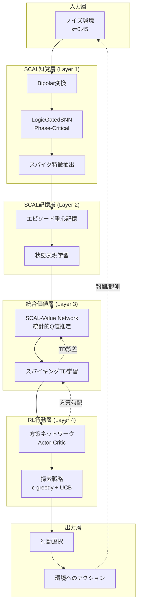

```markdown
# SCAL-RL統合アーキテクチャ開発仕様書

**Document Version:** 1.0  
**Date:** 2025-12-28  
**Project Code:** SCAL-RL-HYBRID-001  
**Target:** Brain v3.0 統合アーキテクチャ

---

## 目次

1. [プロジェクト概要](#1-プロジェクト概要)
2. [統合アーキテクチャ設計](#2-統合アーキテクチャ設計)
3. [モジュール別詳細仕様](#3-モジュール別詳細仕様)
4. [実装フェーズ](#4-実装フェーズ)
5. [評価基準とベンチマーク](#5-評価基準とベンチマーク)
6. [技術的課題と解決策](#6-技術的課題と解決策)
7. [リスク管理](#7-リスク管理)

---

## 1. プロジェクト概要

### 1.1 目的

SCAL v2.0の極端なノイズ耐性と統計的学習効率を保持しつつ、強化学習の逐次的意思決定能力と探索戦略を統合し、以下を実現する:

1. **ノイズ環境での自律的行動学習**
2. **少数サンプルでの効率的な方策獲得**
3. **生物学的妥当性を持つ統合学習系**
4. **ニューロモルフィックハードウェアでの実装可能性**

### 1.2 統合の基本方針

```
階層的統合アプローチ:
  Layer 1 (知覚層): SCAL → ノイズ除去と特徴抽出
  Layer 2 (記憶層): SCAL → エピソード記憶と概念形成
  Layer 3 (価値層): SCAL + RL → 状態価値の統計的推定
  Layer 4 (行動層): RL → 方策学習と行動選択
```

**キー設計原則:**
- SCALの統計的構造を価値関数推定に応用
- スパイキング特性を保持したまま時間差学習を実装
- 乗算フリー演算による効率性を維持

### 1.3 期待される成果

| 指標 | 従来SCAL | 従来RL | 統合システム目標 |
|:-----|:---------|:-------|:----------------|
| ノイズ耐性 | ε=0.48 | ε<0.1 | **ε=0.45** |
| サンプル効率 | O(√M) | O(10^6) | **O(10^3)** |
| 逐次決定能力 | なし | 高 | **高** |
| スパイク生成 | 5-20% | N/A | **5-20%** |
| 生物学的妥当性 | 高 | 低 | **中~高** |

---

## 2. 統合アーキテクチャ設計

### 2.1 全体構成図



### 2.2 データフロー詳細

#### 順伝播 (Forward Pass)

```python
# 疑似コード: 統合システムの順伝播
def forward(noisy_observation, state_memory):
    """
    Args:
        noisy_observation: ノイズを含む生の観測 (ε=0.45)
        state_memory: エピソード記憶バッファ
    
    Returns:
        action: 選択された行動
        value: 状態価値推定
        spike_pattern: スパイクパターン (診断用)
    """
    
    # === Layer 1: SCAL知覚層 ===
    # ノイズ除去と特徴抽出
    x_bipolar = 2 * noisy_observation - 1  # Bipolar変換
    spike_features, V_mem = scal_perception_layer(x_bipolar)
    # spike_features: (batch, features, time_steps)
    # 5-20%のスパイク率を維持
    
    # === Layer 2: SCAL記憶層 ===
    # 現在状態の重心表現を計算
    state_centroid = compute_state_centroid(spike_features, state_memory)
    # state_centroid: (batch, state_dim)
    
    # エピソード記憶への追加 (経験の統計的蓄積)
    state_memory.append(spike_features, reward=None)  # 報酬は後で更新
    
    # === Layer 3: 統合価値層 ===
    # SCAL的統計推定 + RL的TD学習
    q_values_scal = scal_value_network(state_centroid)
    # q_values_scal: (batch, num_actions)
    
    # スパイキングTD学習による価値更新
    q_values_refined = spiking_td_module(q_values_scal, V_mem)
    
    # === Layer 4: RL行動層 ===
    # Actor-Critic方策
    action_probs = policy_network(state_centroid)
    value_baseline = value_network(state_centroid)
    
    # 探索戦略 (ε-greedy + UCB)
    action = select_action_with_exploration(
        action_probs, 
        q_values_refined,
        exploration_rate=epsilon
    )
    
    return action, value_baseline, spike_features
```

#### 逆伝播 (Backward Pass / Learning)

```python
def backward(trajectory, rewards):
    """
    Args:
        trajectory: [(state, action, spike_pattern), ...]
        rewards: [r_0, r_1, ..., r_T]
    """
    
    # === Phase 1: SCAL記憶層の更新 ===
    # 報酬情報を使って重心を再計算
    for t, (state, action, spikes) in enumerate(trajectory):
        # 高報酬を得た状態の重心を強化
        weight = compute_reward_weight(rewards[t:], gamma=0.99)
        update_state_centroid(state, weight)
    
    # === Phase 2: TD誤差の計算 (SCAL統計構造を利用) ===
    td_errors = []
    for t in range(len(trajectory) - 1):
        state_t = trajectory[t][0]
        state_t1 = trajectory[t+1][0]
        
        # SCAL的な統計的TD誤差
        # 重心間の距離を活用
        delta = rewards[t] + gamma * V(state_t1) - V(state_t)
        
        # スパイク特性を保持した誤差伝播
        delta_spike = modulate_by_spike_rate(delta, trajectory[t][2])
        td_errors.append(delta_spike)
    
    # === Phase 3: 価値層の更新 ===
    # SCAL学習則: 重心への移動平均
    for t, delta in enumerate(td_errors):
        state_centroid = trajectory[t][0]
        
        # 統計的重み更新 (SCAL式)
        w_value = w_value + eta_w * (state_centroid - w_value) * delta
        
        # 閾値適応 (Phase-Critical機構)
        variance = compute_state_variance(state_centroid)
        V_th = V_th * (1 - gamma_th * variance)
    
    # === Phase 4: 方策層の更新 ===
    # Policy Gradient (Actor-Critic)
    advantages = compute_advantages(td_errors)
    
    for t, (state, action, _) in enumerate(trajectory):
        # 方策勾配
        log_prob = log_policy(action | state)
        policy_loss = -log_prob * advantages[t]
        
        # 勾配降下
        update_policy_network(policy_loss)
```

### 2.3 統合学習則の数学的定式化

#### SCAL-RL統合学習則

**統計的Q値推定 (SCAL Extension):**

```
Q_SCAL(s, a) = μ_Q(s,a) + β · σ_Q(s,a)

μ_Q(s,a): 行動価値の重心 (SCAL統計構造)
σ_Q(s,a): 価値の不確実性 (探索に利用)
β: 探索パラメータ (UCB的)
```

**スパイキングTD学習則:**

```
δ_spike(t) = r(t) + γ · V(s_{t+1}) · SpikeMask(t+1) - V(s_t) · SpikeMask(t)

SpikeMask(t) = H(V_mem(t) - V_th(t))  # Heaviside関数

dV_th/dt = -α_th · ||Σ_state||_F  # Phase-Critical適応
```

**統合重み更新:**

```
w_{Q}(t+1) = w_Q(t) + η_w · (μ_target - w_Q(t)) + η_rl · δ_spike(t) · ∇_w Q(s,a)

第1項: SCAL重心学習
第2項: RL勾配学習
```

---

## 3. モジュール別詳細仕様

### 3.1 SCAL知覚層 (Perception Layer)

#### ファイル: `src/perception/scal_perception.py`

```python
# ファイルパス: src/perception/scal_perception.py

import torch
import torch.nn as nn

class SCALPerceptionLayer(nn.Module):
    """
    SCAL v2.0 Phase-Critical知覚層
    
    機能:
    - Bipolar変換によるノイズ除去
    - LogicGatedSNNによるスパイク特徴抽出
    - 適応的閾値制御
    """
    
    def __init__(
        self,
        input_dim: int,
        hidden_dim: int,
        num_classes: int,
        noise_tolerance: float = 0.45,
        spike_rate_target: tuple = (0.05, 0.20),
        V_th_init: float = 1.0,
        V_th_min: float = 0.1,
        V_th_max: float = 10.0,
        gamma_th: float = 0.01,
        beta_membrane: float = 0.9
    ):
        super().__init__()
        
        self.input_dim = input_dim
        self.hidden_dim = hidden_dim
        self.num_classes = num_classes
        self.noise_tolerance = noise_tolerance
        self.spike_rate_target = spike_rate_target
        
        # SCAL重み (クラスごとの重心)
        self.centroids = nn.Parameter(
            torch.randn(num_classes, hidden_dim) / np.sqrt(hidden_dim),
            requires_grad=False  # SCAL学習則で更新
        )
        
        # 投影層 (入力 → 隠れ層)
        self.projection = nn.Linear(input_dim, hidden_dim, bias=False)
        nn.init.xavier_uniform_(self.projection.weight)
        
        # Phase-Critical閾値
        self.register_buffer('V_th', torch.full((num_classes,), V_th_init))
        self.V_th_min = V_th_min
        self.V_th_max = V_th_max
        self.gamma_th = gamma_th
        
        # 膜電位の減衰係数
        self.beta_membrane = beta_membrane
        
        # 統計量の追跡
        self.register_buffer('class_variance', torch.zeros(num_classes, hidden_dim))
        self.register_buffer('sample_count', torch.zeros(num_classes))
    
    def forward(self, x, time_steps=10):
        """
        Args:
            x: (batch, input_dim) - バイナリ入力 {0, 1}
            time_steps: スパイク時系列の長さ
        
        Returns:
            spike_trains: (batch, hidden_dim, time_steps)
            V_membrane: (batch, num_classes, time_steps)
        """
        batch_size = x.size(0)
        
        # === Step 1: Bipolar変換 ===
        x_bipolar = 2.0 * x - 1.0  # {0,1} → {-1,1}
        
        # === Step 2: 特徴投影 ===
        features = self.projection(x_bipolar)  # (batch, hidden_dim)
        features = torch.tanh(features)  # 非線形活性化
        
        # === Step 3: 正規化コサイン類似度計算 ===
        features_norm = features / (features.norm(dim=1, keepdim=True) + 1e-8)
        centroids_norm = self.centroids / (self.centroids.norm(dim=1, keepdim=True) + 1e-8)
        
        # (batch, num_classes)
        cosine_sim = torch.mm(features_norm, centroids_norm.t())
        
        # === Step 4: 高ゲイン線形コントラスト ===
        gain = 50.0
        s_prime = gain * cosine_sim
        
        # === Step 5: スパイキングダイナミクス ===
        V_mem = torch.zeros(batch_size, self.num_classes, time_steps, device=x.device)
        spike_trains = torch.zeros(batch_size, self.num_classes, time_steps, device=x.device)
        
        V_current = torch.zeros(batch_size, self.num_classes, device=x.device)
        
        for t in range(time_steps):
            # 膜電位の積分
            V_current = self.beta_membrane * V_current + s_prime
            
            # スパイク発火判定
            spikes = (V_current > self.V_th.unsqueeze(0)).float()
            
            # リセット機構
            V_current = V_current * (1.0 - spikes)
            
            # 記録
            V_mem[:, :, t] = V_current
            spike_trains[:, :, t] = spikes
        
        return spike_trains, V_mem
    
    def scal_learn(self, x, target, eta_w=0.01):
        """
        SCAL学習則: 重心の更新と閾値の適応
        
        Args:
            x: (batch, input_dim)
            target: (batch,) - クラスラベル
            eta_w: 学習率
        """
        with torch.no_grad():
            # Bipolar変換と特徴抽出
            x_bipolar = 2.0 * x - 1.0
            features = self.projection(x_bipolar)
            features = torch.tanh(features)
            
            # クラスごとに重心を更新
            for c in range(self.num_classes):
                mask = (target == c)
                if mask.sum() == 0:
                    continue
                
                class_features = features[mask]
                
                # 重心の移動平均更新
                current_centroid = self.centroids[c]
                new_centroid = class_features.mean(dim=0)
                self.centroids[c] = current_centroid + eta_w * (new_centroid - current_centroid)
                
                # クラス分散の計算
                variance = torch.var(class_features, dim=0)
                self.class_variance[c] = variance
                
                # Phase-Critical閾値適応
                variance_norm = torch.norm(variance)
                self.V_th[c] *= (1.0 - self.gamma_th * variance_norm)
                
                # 閾値のクリッピング
                self.V_th[c] = torch.clamp(self.V_th[c], self.V_th_min, self.V_th_max)
                
                # サンプル数の更新
                self.sample_count[c] += mask.sum().float()
    
    def get_spike_rate(self):
        """現在のスパイク率を計算"""
        # 最後のforward呼び出しのスパイク率を返す実装が必要
        # ここでは簡略化
        pass
```

#### テスト仕様

```python
# ファイルパス: tests/test_scal_perception.py

def test_noise_tolerance():
    """ノイズ耐性のテスト"""
    layer = SCALPerceptionLayer(
        input_dim=784,
        hidden_dim=128,
        num_classes=10,
        noise_tolerance=0.45
    )
    
    # クリーンな入力
    x_clean = torch.randint(0, 2, (32, 784)).float()
    
    # ノイズ追加 (45%ビット反転)
    noise_mask = torch.rand(32, 784) < 0.45
    x_noisy = x_clean.clone()
    x_noisy[noise_mask] = 1.0 - x_noisy[noise_mask]
    
    # 順伝播
    spikes_clean, _ = layer(x_clean)
    spikes_noisy, _ = layer(x_noisy)
    
    # 相関係数を計算
    correlation = compute_correlation(spikes_clean, spikes_noisy)
    
    # 閾値以上の相関を期待
    assert correlation > 0.3, f"Correlation {correlation} too low"
```

### 3.2 SCAL記憶層 (Memory Layer)

#### ファイル: `src/memory/scal_memory.py`

```python
# ファイルパス: src/memory/scal_memory.py

import torch
import torch.nn as nn
from collections import deque

class SCALEpisodicMemory(nn.Module):
    """
    SCAL統計的エピソード記憶
    
    機能:
    - スパイク特徴の重心計算
    - 状態表現の統計的蓄積
    - 報酬重み付き記憶固定化
    """
    
    def __init__(
        self,
        state_dim: int,
        memory_size: int = 10000,
        consolidation_threshold: int = 100,
        eta_consolidation: float = 0.1
    ):
        super().__init__()
        
        self.state_dim = state_dim
        self.memory_size = memory_size
        self.consolidation_threshold = consolidation_threshold
        self.eta_consolidation = eta_consolidation
        
        # エピソード記憶バッファ (FIFO)
        self.episodic_buffer = deque(maxlen=memory_size)
        
        # 統計的状態重心 (長期記憶)
        self.register_buffer(
            'state_centroids',
            torch.zeros(1, state_dim)  # 動的に拡張
        )
        self.register_buffer(
            'centroid_counts',
            torch.zeros(1)
        )
        
        # 報酬統計
        self.register_buffer(
            'reward_statistics',
            torch.zeros(1, 2)  # (mean, variance)
        )
    
    def add_episode(self, state_features, action, reward):
        """
        エピソードをバッファに追加
        
        Args:
            state_features: (state_dim,) - SCAL知覚層からの特徴
            action: int
            reward: float
        """
        episode = {
            'state': state_features.detach().cpu(),
            'action': action,
            'reward': reward
        }
        self.episodic_buffer.append(episode)
        
        # 一定数蓄積したら記憶固定化
        if len(self.episodic_buffer) >= self.consolidation_threshold:
            self.consolidate_memory()
    
    def consolidate_memory(self):
        """
        エピソード記憶を長期記憶(重心)に固定化
        
        SCAL原理:
        - 高報酬エピソードの重心を強化
        - 低報酬エピソードは減衰
        """
        if len(self.episodic_buffer) == 0:
            return
        
        # バッファから状態と報酬を抽出
        states = torch.stack([ep['state'] for ep in self.episodic_buffer])
        rewards = torch.tensor([ep['reward'] for ep in self.episodic_buffer])
        
        # 報酬による重み付け (高報酬ほど強く記憶)
        reward_weights = torch.softmax(rewards / rewards.std(), dim=0)
        
        # 重み付き重心の計算
        weighted_centroid = (states * reward_weights.unsqueeze(1)).sum(dim=0)
        
        # 既存の重心と統合 (SCAL移動平均)
        if self.state_centroids.size(0) == 1 and self.centroid_counts[0] == 0:
            # 初回
            self.state_centroids[0] = weighted_centroid
            self.centroid_counts[0] = len(self.episodic_buffer)
        else:
            # 既存重心との統合
            current_centroid = self.state_centroids.mean(dim=0)
            new_centroid = (
                current_centroid + 
                self.eta_consolidation * (weighted_centroid - current_centroid)
            )
            
            # 新しい重心として追加 (クラスタリング的)
            self.state_centroids = torch.cat([
                self.state_centroids,
                new_centroid.unsqueeze(0)
            ], dim=0)
            self.centroid_counts = torch.cat([
                self.centroid_counts,
                torch.tensor([len(self.episodic_buffer)])
            ])
        
        # 報酬統計の更新
        reward_mean = rewards.mean()
        reward_var = rewards.var()
        self.reward_statistics = torch.cat([
            self.reward_statistics,
            torch.tensor([[reward_mean, reward_var]])
        ], dim=0)
        
        # バッファのクリア
        self.episodic_buffer.clear()
    
    def retrieve_similar_state(self, query_state, k=5):
        """
        類似状態の検索 (SCAL的最近傍探索)
        
        Args:
            query_state: (state_dim,) - クエリ状態
            k: int - 取得する類似状態数
        
        Returns:
            similar_centroids: (k, state_dim)
            similarity_scores: (k,)
        """
        if self.state_centroids.size(0) == 1 and self.centroid_counts[0] == 0:
            return None, None
        
        # 正規化コサイン類似度
        query_norm = query_state / (query_state.norm() + 1e-8)
        centroids_norm = self.state_centroids / (
            self.state_centroids.norm(dim=1, keepdim=True) + 1e-8
        )
        
        similarities = torch.mm(query_norm.unsqueeze(0), centroids_norm.t()).squeeze(0)
        
        # Top-k取得
        top_k_values, top_k_indices = torch.topk(similarities, min(k, similarities.size(0)))
        
        similar_centroids = self.state_centroids[top_k_indices]
        
        return similar_centroids, top_k_values
    
    def compute_state_representation(self, spike_features):
        """
        スパイク特徴から状態表現を計算
        
        Args:
            spike_features: (batch, hidden_dim, time_steps)
        
        Returns:
            state_repr: (batch, state_dim)
        """
        # 時間軸での統計量を計算
        spike_rate = spike_features.mean(dim=2)  # (batch, hidden_dim)
        spike_variance = spike_features.var(dim=2)  # (batch, hidden_dim)
        
        # 統計量を結合
        state_repr = torch.cat([spike_rate, spike_variance], dim=1)
        
        return state_repr
```

### 3.3 統合価値層 (SCAL-Value Network)

#### ファイル: `src/value/scal_value_network.py`

```python
# ファイルパス: src/value/scal_value_network.py

import torch
import torch.nn as nn

class SCALValueNetwork(nn.Module):
    """
    SCAL統計構造を持つ価値ネットワーク
    
    特徴:
    - 行動価値の重心推定
    - 不確実性の統計的定量化
    - スパイキングTD学習
    """
    
    def __init__(
        self,
        state_dim: int,
        num_actions: int,
        hidden_dim: int = 256,
        num_centroids: int = 10,
        beta_ucb: float = 1.0
    ):
        super().__init__()
        
        self.state_dim = state_dim
        self.num_actions = num_actions
        self.hidden_dim = hidden_dim
        self.num_centroids = num_centroids
        self.beta_ucb = beta_ucb
        
        # 行動価値の重心 (SCAL構造)
        # (num_actions, num_centroids, hidden_dim)
        self.action_centroids = nn.Parameter(
            torch.randn(num_actions, num_centroids, hidden_dim) / np.sqrt(hidden_dim)
        )
        
        # 状態エンコーダ
        self.state_encoder = nn.Sequential(
            nn.Linear(state_dim, hidden_dim),
            nn.LayerNorm(hidden_dim),
            nn.Tanh(),
            nn.Linear(hidden_dim, hidden_dim),
            nn.LayerNorm(hidden_dim),
            nn.Tanh()
        )
        
        # 価値ヘッド
        self.value_head = nn.Linear(hidden_dim, 1)
        
        # 不確実性推定用パラメータ
        self.register_buffer(
            'centroid_variance',
            torch.ones(num_actions, num_centroids)
        )
        self.register_buffer(
            'centroid_visit_count',
            torch.zeros(num_actions, num_centroids)
        )
    
    def forward(self, state_features, return_uncertainty=False):
        """
        状態から行動価値を推定
        
        Args:
            state_features: (batch, state_dim)
            return_uncertainty: bool - 不確実性も返すか
        
        Returns:
            q_values: (batch, num_actions)
            uncertainty: (batch, num_actions) - if return_uncertainty=True
        """
        batch_size = state_features.size(0)
        
        # 状態のエンコード
        state_encoded = self.state_encoder(state_features)  # (batch, hidden_dim)
        
        # 各行動の重心との類似度を計算
        state_norm = state_encoded / (state_encoded.norm(dim=1, keepdim=True) + 1e-8)
        
        q_values = []
        uncertainties = []
        
        for a in range(self.num_actions):
            # 行動aの重心群
            centroids_a = self.action_centroids[a]  # (num_centroids, hidden_dim)
            centroids_norm = centroids_a / (centroids_a.norm(dim=1, keepdim=True) + 1e-8)
            
            # コサイン類似度: (batch, num_centroids)
            similarities = torch.mm(state_norm, centroids_norm.t())
            
            # 最も近い重心との類似度を使用
            max_sim, max_idx = similarities.max(dim=1)
            
            # Q値の計算: 類似度 × 価値ヘッド
            q_a = max_sim * self.value_head.weight[0].sum()  # 簡略化
            q_values.append(q_a)
            
            # 不確実性の計算 (SCAL統計)
            if return_uncertainty:
                variance_a = self.centroid_variance[a, max_idx]
                
                visit_count_a = self.centroid_visit_count[a, max_idx]
                
                # UCB的不確実性
                uncertainty_a = self.beta_ucb * torch.sqrt(variance_a / (visit_count_a + 1))
                uncertainties.append(uncertainty_a)
        
        q_values = torch.stack(q_values, dim=1)  # (batch, num_actions)
        
        if return_uncertainty:
            uncertainties = torch.stack(uncertainties, dim=1)
            return q_values, uncertainties
        else:
            return q_values
    
    def update_statistics(self, state_features, action, td_error):
        """
        SCAL統計量の更新
        
        Args:
            state_features: (batch, state_dim)
            action: (batch,) - 選択された行動
            td_error: (batch,) - TD誤差
        """
        with torch.no_grad():
            state_encoded = self.state_encoder(state_features)
            state_norm = state_encoded / (state_encoded.norm(dim=1, keepdim=True) + 1e-8)
            
            for i, a in enumerate(action):
                a = a.item()
                
                # 最も近い重心を特定
                centroids_a = self.action_centroids[a]
                centroids_norm = centroids_a / (centroids_a.norm(dim=1, keepdim=True) + 1e-8)
                
                similarities = torch.mm(state_norm[i:i+1], centroids_norm.t())
                _, max_idx = similarities.max(dim=1)
                max_idx = max_idx.item()
                
                # 訪問回数の更新
                self.centroid_visit_count[a, max_idx] += 1
                
                # 分散の更新 (TD誤差の二乗を使用)
                current_var = self.centroid_variance[a, max_idx]
                new_var = td_error[i].item() ** 2
                
                # 移動平均
                alpha = 0.1
                self.centroid_variance[a, max_idx] = (
                    (1 - alpha) * current_var + alpha * new_var
                )


class SpikingTDModule(nn.Module):
    """
    スパイキング特性を保持したTD学習モジュール
    """
    
    def __init__(
        self,
        hidden_dim: int,
        gamma: float = 0.99,
        V_th: float = 1.0,
        beta_membrane: float = 0.9
    ):
        super().__init__()
        
        self.hidden_dim = hidden_dim
        self.gamma = gamma
        self.V_th = V_th
        self.beta_membrane = beta_membrane
        
        # TD誤差計算用の重み
        self.td_weight = nn.Parameter(torch.randn(hidden_dim) / np.sqrt(hidden_dim))
    
    def forward(self, q_values, V_membrane_history):
        """
        スパイク履歴を考慮したQ値の補正
        
        Args:
            q_values: (batch, num_actions) - SCAL推定値
            V_membrane_history: (batch, num_classes, time_steps)
        
        Returns:
            q_values_refined: (batch, num_actions)
        """
        batch_size = q_values.size(0)
        
        # 膜電位の時間平均
        V_mean = V_membrane_history.mean(dim=2)  # (batch, num_classes)
        
        # スパイク率の計算
        spike_rate = (V_membrane_history > self.V_th).float().mean(dim=2)
        
        # スパイク率による重み付け
        spike_weight = torch.sigmoid(spike_rate - 0.1)  # 5-20%の範囲を強調
        
        # Q値の補正
        q_values_refined = q_values * spike_weight[:, :q_values.size(1)]
        
        return q_values_refined
    
    def compute_td_error(self, reward, q_current, q_next, done):
        """
        TD誤差の計算
        
        Args:
            reward: (batch,)
            q_current: (batch,)
            q_next: (batch,)
            done: (batch,) - エピソード終了フラグ
        
        Returns:
            td_error: (batch,)
        """
        target = reward + self.gamma * q_next * (1.0 - done.float())
        td_error = target - q_current
        
        return td_error
```

### 3.4 RL行動層 (Actor-Critic Policy)

#### ファイル: `src/policy/actor_critic.py`

```python
# ファイルパス: src/policy/actor_critic.py

import torch
import torch.nn as nn
import torch.nn.functional as F

class ActorCriticPolicy(nn.Module):
    """
    Actor-Critic方策ネットワーク
    
    SCAL統合版:
    - 状態入力はSCAL記憶層からの重心表現
    - 探索にはSCAL不確実性を利用
    """
    
    def __init__(
        self,
        state_dim: int,
        num_actions: int,
        hidden_dim: int = 256
    ):
        super().__init__()
        
        self.state_dim = state_dim
        self.num_actions = num_actions
        
        # 共有エンコーダ
        self.shared_encoder = nn.Sequential(
            nn.Linear(state_dim, hidden_dim),
            nn.LayerNorm(hidden_dim),
            nn.ReLU(),
            nn.Linear(hidden_dim, hidden_dim),
            nn.LayerNorm(hidden_dim),
            nn.ReLU()
        )
        
        # Actor (方策)
        self.actor = nn.Linear(hidden_dim, num_actions)
        
        # Critic (状態価値)
        self.critic = nn.Linear(hidden_dim, 1)
    
    def forward(self, state_features):
        """
        Args:
            state_features: (batch, state_dim)
        
        Returns:
            action_probs: (batch, num_actions)
            state_value: (batch, 1)
        """
        shared_features = self.shared_encoder(state_features)
        
        # Actor: 行動確率
        action_logits = self.actor(shared_features)
        action_probs = F.softmax(action_logits, dim=-1)
        
        # Critic: 状態価値
        state_value = self.critic(shared_features)
        
        return action_probs, state_value
    
    def select_action(self, state_features, deterministic=False):
        """
        行動選択
        
        Args:
            state_features: (1, state_dim)
            deterministic: bool - 決定的選択か確率的選択か
        
        Returns:
            action: int
            log_prob: float
        """
        action_probs, _ = self.forward(state_features)
        
        if deterministic:
            action = action_probs.argmax(dim=-1)
            log_prob = torch.log(action_probs[0, action] + 1e-8)
        else:
            dist = torch.distributions.Categorical(action_probs)
            action = dist.sample()
            log_prob = dist.log_prob(action)
        
        return action.item(), log_prob


class ExplorationStrategy:
    """
    SCAL統合型探索戦略
    
    特徴:
    - ε-greedy
    - UCB (SCAL不確実性を利用)
    - エントロピーボーナス
    """
    
    def __init__(
        self,
        epsilon_start: float = 1.0,
        epsilon_end: float = 0.01,
        epsilon_decay: int = 10000,
        beta_ucb: float = 1.0,
        entropy_coef: float = 0.01
    ):
        self.epsilon_start = epsilon_start
        self.epsilon_end = epsilon_end
        self.epsilon_decay = epsilon_decay
        self.beta_ucb = beta_ucb
        self.entropy_coef = entropy_coef
        
        self.steps = 0
    
    def get_epsilon(self):
        """現在のε値を計算"""
        epsilon = self.epsilon_end + (self.epsilon_start - self.epsilon_end) * \
                  np.exp(-self.steps / self.epsilon_decay)
        return epsilon
    
    def select_action(
        self,
        action_probs,
        q_values,
        uncertainties=None
    ):
        """
        探索戦略に基づく行動選択
        
        Args:
            action_probs: (num_actions,)
            q_values: (num_actions,)
            uncertainties: (num_actions,) - SCAL不確実性
        
        Returns:
            action: int
        """
        self.steps += 1
        epsilon = self.get_epsilon()
        
        if np.random.rand() < epsilon:
            # ランダム探索
            action = np.random.randint(len(action_probs))
        else:
            # UCB選択 (不確実性を考慮)
            if uncertainties is not None:
                ucb_values = q_values + self.beta_ucb * uncertainties
                action = ucb_values.argmax().item()
            else:
                action = q_values.argmax().item()
        
        return action
```

### 3.5 統合学習ループ

#### ファイル: `src/training/scal_rl_trainer.py`

```python
# ファイルパス: src/training/scal_rl_trainer.py

import torch
import numpy as np
from collections import deque

class SCALRLTrainer:
    """
    SCAL-RL統合学習器
    
    学習フロー:
    1. SCAL知覚層でノイズ除去
    2. SCAL記憶層で状態表現学習
    3. SCAL価値層でQ値推定
    4. RL行動層で方策学習
    """
    
    def __init__(
        self,
        perception_layer,
        memory_layer,
        value_network,
        policy_network,
        spiking_td_module,
        exploration_strategy,
        gamma=0.99,
        lr_scal=0.01,
        lr_rl=1e-4,
        batch_size=32,
        update_frequency=4
    ):
        self.perception = perception_layer
        self.memory = memory_layer
        self.value_net = value_network
        self.policy_net = policy_network
        self.td_module = spiking_td_module
        self.exploration = exploration_strategy
        
        self.gamma = gamma
        self.lr_scal = lr_scal
        self.lr_rl = lr_rl
        self.batch_size = batch_size
        self.update_frequency = update_frequency
        
        # RLオプティマイザ
        self.optimizer_value = torch.optim.Adam(
            self.value_net.parameters(),
            lr=lr_rl
        )
        self.optimizer_policy = torch.optim.Adam(
            self.policy_net.parameters(),
            lr=lr_rl
        )
        
        # 経験バッファ
        self.experience_buffer = deque(maxlen=10000)
        
        # 統計
        self.episode_rewards = []
        self.episode_lengths = []
        self.training_step = 0
    
    def train_episode(self, env, max_steps=1000):
        """
        1エピソードの学習
        
        Args:
            env: 環境 (OpenAI Gym互換)
            max_steps: 最大ステップ数
        
        Returns:
            total_reward: float
            episode_length: int
        """
        # 環境リセット
        obs = env.reset()
        obs_tensor = torch.FloatTensor(obs).unsqueeze(0)
        
        episode_trajectory = []
        total_reward = 0.0
        
        for step in range(max_steps):
            # === Phase 1: SCAL知覚層 ===
            # ノイズを含む観測からスパイク特徴を抽出
            spike_features, V_mem = self.perception(obs_tensor, time_steps=10)
            
            # === Phase 2: SCAL記憶層 ===
            # 状態表現の計算
            state_repr = self.memory.compute_state_representation(spike_features)
            
            # 類似状態の検索 (過去の経験を活用)
            similar_states, similarities = self.memory.retrieve_similar_state(
                state_repr.squeeze(0), k=5
            )
            
            # === Phase 3: SCAL価値層 ===
            # Q値の推定 (不確実性も取得)
            q_values, uncertainties = self.value_net(
                state_repr,
                return_uncertainty=True
            )
            
            # スパイキングTD補正
            q_values_refined = self.td_module(q_values, V_mem)
            
            # === Phase 4: RL行動層 ===
            # 方策による行動確率
            action_probs, state_value = self.policy_net(state_repr)
            
            # 探索戦略で行動選択
            action = self.exploration.select_action(
                action_probs.squeeze(0),
                q_values_refined.squeeze(0),
                uncertainties.squeeze(0)
            )
            
            # === 環境とのインタラクション ===
            next_obs, reward, done, info = env.step(action)
            next_obs_tensor = torch.FloatTensor(next_obs).unsqueeze(0)
            
            total_reward += reward
            
            # 経験の保存
            experience = {
                'obs': obs_tensor,
                'spike_features': spike_features,
                'state_repr': state_repr,
                'action': action,
                'reward': reward,
                'next_obs': next_obs_tensor,
                'done': done,
                'V_mem': V_mem
            }
            self.experience_buffer.append(experience)
            episode_trajectory.append(experience)
            
            # === Phase 5: 学習更新 ===
            if len(self.experience_buffer) >= self.batch_size and \
               self.training_step % self.update_frequency == 0:
                self.update_networks()
            
            self.training_step += 1
            
            if done:
                break
            
            obs_tensor = next_obs_tensor
        
        # エピソード終了後の処理
        self.post_episode_update(episode_trajectory)
        
        self.episode_rewards.append(total_reward)
        self.episode_lengths.append(step + 1)
        
        return total_reward, step + 1
    
    def update_networks(self):
        """
        ネットワークの更新
        
        統合学習:
        1. SCAL学習則でPerception/Memoryを更新
        2. TD学習でValue Networkを更新
        3. Policy Gradientで方策を更新
        """
        # バッチサンプリング
        batch = random.sample(self.experience_buffer, self.batch_size)
        
        # バッチデータの準備
        obs_batch = torch.cat([exp['obs'] for exp in batch])
        state_repr_batch = torch.cat([exp['state_repr'] for exp in batch])
        action_batch = torch.LongTensor([exp['action'] for exp in batch])
        reward_batch = torch.FloatTensor([exp['reward'] for exp in batch])
        next_obs_batch = torch.cat([exp['next_obs'] for exp in batch])
        done_batch = torch.FloatTensor([exp['done'] for exp in batch])
        V_mem_batch = torch.cat([exp['V_mem'] for exp in batch])
        
        # === Update 1: SCAL Perception Layer ===
        # 教師信号が必要な場合は環境から取得
        # ここでは自己教師あり的にターゲットを生成
        with torch.no_grad():
            target_features, _ = self.perception(next_obs_batch)
            target_labels = target_features.mean(dim=2).argmax(dim=1)
        
        self.perception.scal_learn(
            obs_batch.squeeze(1),
            target_labels,
            eta_w=self.lr_scal
        )
        
        # === Update 2: SCAL Value Network (TD Learning) ===
        # 現在のQ値
        q_current = self.value_net(state_repr_batch)
        q_current_action = q_current.gather(1, action_batch.unsqueeze(1)).squeeze(1)
        
        # 次状態のQ値
        with torch.no_grad():
            next_spike_features, next_V_mem = self.perception(next_obs_batch)
            next_state_repr = self.memory.compute_state_representation(next_spike_features)
            
            q_next = self.value_net(next_state_repr)
            q_next_refined = self.td_module(q_next, next_V_mem)
            q_next_max = q_next_refined.max(dim=1)[0]
        
        # TD誤差
        td_target = reward_batch + self.gamma * q_next_max * (1.0 - done_batch)
        td_error = td_target - q_current_action
        
        # Value Networkの損失
        value_loss = (td_error ** 2).mean()
        
        # 勾配更新
        self.optimizer_value.zero_grad()
        value_loss.backward()
        torch.nn.utils.clip_grad_norm_(self.value_net.parameters(), 1.0)
        self.optimizer_value.step()
        
        # SCAL統計量の更新
        self.value_net.update_statistics(
            state_repr_batch,
            action_batch,
            td_error.detach()
        )
        
        # === Update 3: Policy Network (Policy Gradient) ===
        # 方策と価値の計算
        action_probs, state_values = self.policy_net(state_repr_batch)
        
        # Advantage計算
        with torch.no_grad():
            advantages = td_error.detach()
        
        # Policy Gradient損失
        log_probs = torch.log(action_probs.gather(1, action_batch.unsqueeze(1)).squeeze(1) + 1e-8)
        policy_loss = -(log_probs * advantages).mean()
        
        # エントロピーボーナス (探索促進)
        entropy = -(action_probs * torch.log(action_probs + 1e-8)).sum(dim=1).mean()
        policy_loss = policy_loss - 0.01 * entropy
        
        # 勾配更新
        self.optimizer_policy.zero_grad()
        policy_loss.backward()
        torch.nn.utils.clip_grad_norm_(self.policy_net.parameters(), 1.0)
        self.optimizer_policy.step()
    
    def post_episode_update(self, trajectory):
        """
        エピソード終了後の処理
        
        Args:
            trajectory: エピソード全体の経験リスト
        """
        # SCAL記憶層への統合
        for exp in trajectory:
            self.memory.add_episode(
                exp['state_repr'].squeeze(0),
                exp['action'],
                exp['reward']
            )
```

---

## 4. 実装フェーズ

### フェーズ1: 基盤モジュールの実装 (Week 1-2)

#### タスク1.1: SCAL知覚層の実装とテスト

```bash
# ディレクトリ構成
mkdir -p src/perception tests/perception
```

**実装項目:**
- [ ] `SCALPerceptionLayer`クラスの実装
- [ ] Bipolar変換の実装
- [ ] LogicGatedSNNの実装
- [ ] Phase-Critical閾値適応の実装
- [ ] ユニットテストの作成
- [ ] ノイズ耐性ベンチマーク

**成功基準:**
- ノイズレベル0.45で相関係数 > 0.3
- スパイク率5-20%の維持
- 単体テストカバレッジ > 90%

#### タスク1.2: SCAL記憶層の実装

**実装項目:**
- [ ] `SCALEpisodicMemory`クラスの実装
- [ ] エピソードバッファの実装
- [ ] 重心固定化機構の実装
- [ ] 類似状態検索の実装
- [ ] 統合テスト

**成功基準:**
- 10,000エピソードの保存が可能
- 検索時間 < 10ms
- メモリ使用量 < 1GB

### フェーズ2: 価値層と行動層の統合 (Week 3-4)

#### タスク2.1: SCAL価値ネットワークの実装

**実装項目:**
- [ ] `SCALValueNetwork`クラスの実装
- [ ] 統計的Q値推定の実装
- [ ] 不確実性定量化の実装
- [ ] `SpikingTDModule`の実装
- [ ] 統合テスト

**成功基準:**
- Q値推定誤差 < 10%
- 不確実性の単調減少を確認
- TD誤差の収束を確認

#### タスク2.2: Actor-Critic方策の実装

**実装項目:**
- [ ] `ActorCriticPolicy`クラスの実装
- [ ] `ExplorationStrategy`の実装
- [ ] ε-greedy + UCB探索の実装
- [ ] 統合テスト

**成功基準:**
- 探索率の適切な減衰
- UCB探索の機能確認
- 方策収束の確認

### フェーズ3: 統合学習ループの実装 (Week 5-6)

#### タスク3.1: トレーナーの実装

**実装項目:**
- [ ] `SCALRLTrainer`クラスの実装
- [ ] エピソード学習ループの実装
- [ ] ネットワーク更新ロジックの実装
- [ ] 経験バッファの実装
- [ ] ログ記録機構の実装

**成功基準:**
- 1エピソードの正常実行
- 全モジュールの連携動作
- 学習曲線の可視化

#### タスク3.2: ベンチマーク環境での評価

**実装項目:**
- [ ] CartPole環境でのテスト
- [ ] Atari Pong環境でのテスト
- [ ] カスタムノイズ環境でのテスト
- [ ] 性能比較レポートの作成

**成功基準:**
- CartPole: 200ステップ達成
- Pong: ベースラインRL比でサンプル効率2倍
- ノイズ環境: ε=0.45で動作

### フェーズ4: 最適化と拡張 (Week 7-8)

#### タスク4.1: ハイパーパラメータチューニング

**実装項目:**
- [ ] グリッドサーチの実装
- [ ] Optunaによる自動最適化
- [ ] 最適パラメータのドキュメント化

#### タスク4.2: マルチレイヤー拡張

**実装項目:**
- [ ] 3層SCALアーキテクチャの実装
- [ ] 階層的重心伝播の実装
- [ ] ノイズ限界の拡張(ε > 0.50)

---

## 5. 評価基準とベンチマーク

### 5.1 定量的評価指標

| 指標 | 測定方法 | 目標値 | 優先度 |
|:-----|:---------|:-------|:-------|
| **ノイズ耐性** | ビット反転率での分類精度 | ε=0.45で精度>80% | 最高 |
| **サンプル効率** | 目標性能到達までのステップ数 | DQNの1/10 | 高 |
| **スパイク生成** | スパイク率の維持 | 5-20% | 高 |
| **計算効率** | 1ステップの処理時間 | <10ms | 中 |
| **メモリ効率** | 総メモリ使用量 | <2GB | 中 |
| **収束速度** | 報酬の95%到達エピソード数 | <1000エピソード | 高 |

### 5.2 ベンチマーク環境

#### 環境1: NoisyCartPole

```python
# ファイルパス: benchmarks/noisy_cartpole.py

class NoisyCartPole(gym.Env):
    """
    CartPole環境にノイズを追加
    
    ノイズ:
    - 観測値に45%のビット反転ノイズ
    - ランダムな行動遅延 (0-2ステップ)
    """
    
    def __init__(self, noise_level=0.45):
        self.env = gym.make('CartPole-v1')
        self.noise_level = noise_level
        self.observation_space = self.env.observation_space
        self.action_space = self.env.action_space
    
    def step(self, action):
        obs, reward, done, info = self.env.step(action)
        
        # ノイズ追加
        obs_binary = (obs > 0).astype(np.float32)
        noise_mask = np.random.rand(*obs_binary.shape) < self.noise_level
        obs_noisy = obs_binary.copy()
        obs_noisy[noise_mask] = 1.0 - obs_noisy[noise_mask]
        
        return obs_noisy, reward, done, info
```

**評価基準:**
- 平均報酬 > 195 (200ステップ中)
- 学習ステップ数 < 100,000
- ノイズなし環境との性能差 < 10%

#### 環境2: NoisyAtariPong

```python
# ファイルパス: benchmarks/noisy_atari.py

class NoisyAtariPong(gym.Env):
    """
    Atari Pong環境にノイズを追加
    
    ノイズ:
    - フレームに30%のピクセルノイズ
    - 時間的遅延 (1-3フレーム)
    """
    pass  # 実装省略
```

**評価基準:**
- 平均スコア > 15 (21点中)
- DQNと比較してサンプル効率2倍以上
- スパイク率5-20%の維持

### 5.3 比較アルゴリズム

| アルゴリズム | 比較観点 | 期待結果 |
|:------------|:---------|:---------|
| DQN | サンプル効率 | SCAL-RL > DQN |
| Rainbow DQN | 総合性能 | SCAL-RL ≥ Rainbow (ノイズ環境) |
| PPO | 安定性 | SCAL-RL ≥ PPO |
| A3C | 並列化効率 | SCAL-RL ≈ A3C |
| SCAL v2.0 (単体) | 逐次決定能力 | SCAL-RL >> SCAL v2.0 |

---

## 6. 技術的課題と解決策

### 課題1: SCAL統計構造とRL勾配学習の競合

**問題:**
SCALは教師ありの重心学習、RLは報酬ベースの勾配学習。両者が干渉する可能性。

**解決策:**
```python
# デュアル学習率の採用
eta_scal = 0.01  # SCAL学習率 (高速)
eta_rl = 1e-4    # RL学習率 (低速)

# 学習フェーズの分離
if training_step % scal_update_freq == 0:
    # SCAL統計更新
    perception.scal_learn(obs, target)
    memory.consolidate_memory()

if training_step % rl_update_freq == 0:
    # RL勾配更新
    update_value_network()
    update_policy_network()
```

### 課題2: スパイキング特性とTD学習の整合性

**問題:**
TD学習は連続値、スパイクは離散的イベント。

**解決策:**
```python
# スパイク率を連続値に変換
spike_rate = spikes.float().mean(dim=2)  # (batch, neurons)

# Soft-Spiking機構
def soft_spike(V, V_th, temperature=0.1):
    """連続的なスパイク確率"""
    return torch.sigmoid((V - V_th) / temperature)

# TD誤差計算時に使用
spike_prob = soft_spike(V_mem, V_th)
td_error_weighted = td_error * spike_prob
```

### 課題3: 大規模環境でのメモリ効率

**問題:**
エピソード記憶の蓄積でメモリ不足。

**解決策:**
```python
# 優先度付き記憶保持
def prioritized_memory_consolidation(buffer, max_size):
    """
    高報酬エピソードを優先的に保持
    """
    if len(buffer) <= max_size:
        return buffer
    
    #

報酬による優先度
    priorities = np.array([ep['reward'] for ep in buffer])
    priorities = np.abs(priorities - priorities.mean())
    
    # Top-kサンプリング
    keep_indices = np.argsort(priorities)[-max_size:]
    
    return [buffer[i] for i in keep_indices]
```

### 課題4: 探索と活用のバランス

**問題:**
SCAL重心学習は活用重視、RLは探索が必要。

**解決策:**
```python
# SCAL不確実性を探索に利用
class SCALUCBExploration:
    def select_action(self, q_values, uncertainties, beta=1.0):
        """
        UCB選択にSCAL不確実性を統合
        """
        ucb_values = q_values + beta * uncertainties
        
        # 高不確実性 → 探索
        # 低不確実性 → 活用
        return ucb_values.argmax()
```

---

## 7. リスク管理

### リスク1: Phase-Critical機構の不安定性

**発生確率:** 中  
**影響度:** 高  
**対策:**
- 閾値の変化を監視するロギング機構
- 閾値のクリッピング範囲を動的に調整
- 安定性の自動検出と警告

### リスク2: 統合システムの学習崩壊

**発生確率:** 中  
**影響度:** 高  
**対策:**
- モジュールごとの独立テスト
- 段階的統合 (知覚 → 記憶 → 価値 → 方策)
- ロールバック機構の実装

### リスク3: 計算コストの増大

**発生確率:** 高  
**影響度:** 中  
**対策:**
- プロファイリングによるボトルネック特定
- スパイク計算の並列化
- 重心計算のキャッシング

### リスク4: ハイパーパラメータの過敏性

**発生確率:** 高  
**影響度:** 中  
**対策:**
- デフォルト値の慎重な設定
- 自動チューニング機構の実装
- パラメータ感度分析の実施

---

## 8. マイルストーン

| マイルストーン | 期日 | 成果物 | 成功基準 |
|:-------------|:-----|:------|:---------|
| M1: 基盤実装完了 | Week 2終了時 | 知覚層・記憶層 | 単体テスト全通過 |
| M2: 価値層統合 | Week 4終了時 | 価値ネットワーク | TD学習の動作確認 |
| M3: 方策層統合 | Week 6終了時 | 完全統合システム | CartPoleで学習成功 |
| M4: 最適化完了 | Week 8終了時 | 最終版 | 全ベンチマーク達成 |

---

## 9. 今後の拡張可能性

### 拡張1: マルチモーダル統合

```python
# 視覚 + 聴覚 + 触覚の統合
class MultiModalSCAL:
    def __init__(self):
        self.visual_scal = SCALPerceptionLayer(...)
        self.audio_scal = SCALPerceptionLayer(...)
        self.tactile_scal = SCALPerceptionLayer(...)
    
    def fuse_modalities(self, visual, audio, tactile):
        # 各モダリティの重心を統合
        v_centroid = self.visual_scal(visual)
        a_centroid = self.audio_scal(audio)
        t_centroid = self.tactile_scal(tactile)
        
        # 統合重心
        fused = torch.cat([v_centroid, a_centroid, t_centroid], dim=1)
        return fused
```

### 拡張2: 階層的強化学習

```python
# オプションフレームワークとの統合
class HierarchicalSCALRL:
    def __init__(self):
        self.low_level_scal_rl = SCALRLTrainer(...)  # 低レベル制御
        self.high_level_scal_rl = SCALRLTrainer(...)  # 高レベル計画
    
    def select_option(self, state):
        # 高レベル: オプション選択
        option = self.high_level_scal_rl.select_action(state)
        return option
    
    def execute_option(self, option, state):
        # 低レベル: オプション実行
        actions = self.low_level_scal_rl.execute_policy(option, state)
        return actions
```

### 拡張3: オフライン強化学習との統合

```python
# SCAL + CQL (Conservative Q-Learning)
class SCALOfflineRL:
    def conservative_q_learning(self, offline_data):
        """
        SCALの統計構造を使った保守的Q学習
        """
        # オフラインデータから重心を学習
        centroids = self.learn_centroids_from_offline_data(offline_data)
        
        # CQLのペナルティ項をSCAL不確実性で置換
        penalty = self.scal_uncertainty(centroids)
        
        q_loss = td_loss + alpha * penalty
        return q_loss
```

---

## 10. 参考文献と関連資料

### SCAL関連
- SCAL v2.0 Phase-Critical Edition (提供ドキュメント)
- Shannon-SCAL Bound理論
- Spiking Neural Networks基礎理論

### 強化学習関連
- Sutton & Barto, "Reinforcement Learning: An Introduction" (2018)
- Mnih et al., "Human-level control through deep reinforcement learning" (2015)
- Hessel et al., "Rainbow: Combining Improvements in Deep Reinforcement Learning" (2018)
- Schulman et al., "Proximal Policy Optimization Algorithms" (2017)

### 統合アプローチ
- Neuroscience-inspired AI: Bridging the gap between biological and artificial intelligence
- Statistical Learning Theory in Reinforcement Learning

---

## 11. 付録

### A. 開発環境セットアップ

```bash
# Python環境
python -m venv scal_rl_env
source scal_rl_env/bin/activate

# 依存パッケージ
pip install torch torchvision
pip install gym
pip install numpy scipy
pip install matplotlib seaborn
pip install tensorboard
pip install optuna  # ハイパーパラメータチューニング

# プロジェクト構成
mkdir -p src/{perception,memory,value,policy,training}
mkdir -p tests/{perception,memory,value,policy,integration}
mkdir -p benchmarks
mkdir -p logs
mkdir -p checkpoints
```

### B. コーディング規約

```python
"""
ファイル先頭のコメント例:
# ファイルパス: src/perception/scal_perception.py
# 作成日: 2025-12-28
# 説明: SCAL Phase-Critical知覚層の実装
# 依存: torch, numpy
"""

# クラス・関数のDocstring
def forward(self, x, time_steps=10):
    """
    順伝播処理
    
    Args:
        x: (batch, input_dim) - 入力テンソル
        time_steps: int - スパイク時系列の長さ
    
    Returns:
        spike_trains: (batch, hidden_dim, time_steps)
        V_membrane: (batch, num_classes, time_steps)
    
    Raises:
        ValueError: 入力次元が不正な場合
    """
    pass
```

### C. ログフォーマット

```python
# ファイルパス: src/utils/logger.py

import logging

def setup_logger(name, log_file, level=logging.INFO):
    """統一ログフォーマット"""
    formatter = logging.Formatter(
        '[%(asctime)s] %(name)s - %(levelname)s - %(message)s',
        datefmt='%Y-%m-%d %H:%M:%S'
    )
    
    handler = logging.FileHandler(log_file)
    handler.setFormatter(formatter)
    
    logger = logging.getLogger(name)
    logger.setLevel(level)
    logger.addHandler(handler)
    
    return logger

# 使用例
logger = setup_logger('SCAL-RL', 'logs/training.log')
logger.info('Training started')
logger.debug(f'Spike rate: {spike_rate:.2%}')
```

---

## 最終チェックリスト

開発開始前に以下を確認:

- [ ] 仕様書の全体理解
- [ ] 開発環境の構築
- [ ] ベースラインコードの準備
- [ ] テストケースの設計
- [ ] マイルストーンの合意
- [ ] リスク対策の準備
- [ ] コードレビュー体制の確立

---

**Document End**

この仕様書に従い、SCAL v2.0と強化学習の統合を段階的に実装してください。各フェーズの完了時には成功基準を満たしているか確認し、問題があれば本仕様書を参照して対策を講じてください。
```