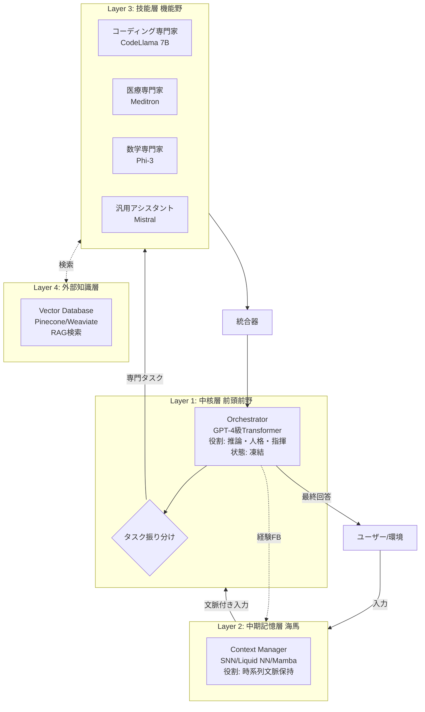

# 生体模倣型ハイブリッドAGIアーキテクチャ統合設計書

## 1. 設計思想の核心

### 1.1 解決すべき根本的問題

現代のLLMは「壊滅的忘却」という致命的欠陥を抱えています。新しい知識を学習させると、過去の記憶や人格が破壊される問題です。

### 1.2 生物学的解決策の模倣

人間の脳は加齢とともに「学習率を下げる」ことで、この問題を解決しています。これは能力低下ではなく、**自己同一性を守りつつ、効率的に適応する生存戦略**です。

### 1.3 本設計の基本原理

**「変わってはいけないもの」と「変わるべきもの」を物理的に分離する**

- **不変層（Core）**: 人格・倫理・推論能力 → 凍結
- **可変層（Periphery）**: 知識・技能・文脈 → 継続学習

---

## 2. 4層アーキテクチャ構造



---

## 3. 各層の詳細仕様

### Layer 1: Cognitive Core（認知中核）

| 項目 | 内容 |
|------|------|
| **脳の対応部位** | 前頭前野 |
| **実装技術** | GPT-4/Claude 3/Llama 405B級 |
| **状態** | **完全凍結（Frozen）** |
| **役割** | ① 人格の核<br/>② タスク振り分け<br/>③ 最終出力の検閲 |
| **学習** | なし（プロンプトのみで制御） |

**設計意図**: 「加齢した脳」として、自己同一性を絶対に守る司令塔。

---

### Layer 2: Adaptive Context（適応文脈）

| 項目 | 内容 |
|------|------|
| **脳の対応部位** | 海馬 |
| **実装技術** | SNN / Liquid NN / Mamba（SSM） |
| **状態** | **流動的（継続学習）** |
| **役割** | ① 対話履歴の保持<br/>② 時系列パターン認識<br/>③ 感情状態の追跡 |
| **学習** | リアルタイム更新 |

**設計意図**: Transformerが苦手な「時間の流れ」を補完。低消費電力で状態を保持し続けるバッファ。

---

### Layer 3: Functional Experts（機能専門家群）

| 項目 | 内容 |
|------|------|
| **脳の対応部位** | 視覚野・言語野など機能局在皮質 |
| **実装技術** | 7B-13Bの小型LLM + LoRA |
| **状態** | **高可塑性・交換可能** |
| **役割** | 特定タスクの実行<br/>（コード生成/医療診断/翻訳など） |
| **学習** | 独立して再学習・追加可能 |

**設計意図**: 「壊滅的忘却」の根本的解決。新技能が必要なら、新しいモジュールを追加するだけ。

| 専門家例 | 推奨モデル | 用途 |
|----------|------------|------|
| Coding | CodeLlama 7B | プログラミング |
| Medical | Meditron | 医療相談 |
| Math | Phi-3 / Orca | 論理・計算 |
| General | Mistral / Gemma | 汎用対話 |

---

### Layer 4: External Knowledge（外部知識）

| 項目 | 内容 |
|------|------|
| **脳の対応部位** | 外部補助記憶（ノート） |
| **実装技術** | Vector DB（Pinecone/Weaviate） |
| **状態** | **非パラメトリック** |
| **役割** | 事実情報の正確な検索 |
| **学習** | なし（データ追加のみ） |

**設計意図**: 幻覚（Hallucination）の抑制。記憶に頼らず、検索結果に基づいて回答。

---

## 4. 処理フロー（実行例）

### シナリオ: 「Pythonで画像処理するコードを書いて」

```
[1] ユーザー入力
    ↓
[2] Layer 2（SNN）が文脈分析
    「直前の会話でPython 3.12を使っていた」
    ↓
[3] Layer 1（Core）が意図理解
    「これはコーディングタスクだ」
    ↓
[4] Router が専門家選択
    → Coding Expert（CodeLlama）を起動
    → Layer 4（RAG）から Python 3.12ドキュメント取得
    ↓
[5] Coding Expert がコード生成
    ↓
[6] Layer 1 が出力を統合
    「丁寧な口調」「コメント追加」などの人格フィルタ適用
    ↓
[7] ユーザーへ回答
    ↓
[8] Layer 2 へフィードバック
    「この会話でPillowライブラリを使った」という情報を記憶
```

---

## 5. 本設計の革新的優位性

### 5.1 壊滅的忘却の完全回避

- **従来**: モデル全体を更新 → 人格崩壊
- **本設計**: 専門モジュール（Layer 3）のみ更新 → Core（Layer 1）は無傷

### 5.2 無限の拡張性

- **従来**: パラメータ数に上限
- **本設計**: モジュール追加で事実上無限

### 5.3 コスト効率

- **従来**: 常に巨大モデルを稼働
- **本設計**: タスクに応じて軽量モデルを起動

| タスク | 従来 | 本設計 |
|--------|------|--------|
| 簡単な計算 | GPT-4（175B） | Phi-3（3.8B） |
| コスト比 | 100% | 約2% |

### 5.4 人格の安定性

Layer 1（Core）を凍結することで、何年運用しても「性格」「価値観」「論理」が一貫。

---

## 6. 実装ロードマップ

### Phase 1: MVP（最小実装）

- Layer 1: 既存LLM（GPT-4 API）
- Layer 3: 1つの専門モジュール（例: コーディング）
- Layer 4: 簡易Vector DB

### Phase 2: 中核機能

- Layer 2: Mambaベースの文脈管理
- Layer 3: 3-5個の専門モジュール追加

### Phase 3: 完全版

- Layer 2: SNN/Liquid NNの実装
- 自動モジュール選択の高度化
- フィードバックループの最適化

---

## 7. 技術スタック推奨

| レイヤー | 推奨技術 | 代替案 |
|----------|----------|--------|
| Layer 1 | GPT-4 API / Llama 405B | Claude 3 Opus |
| Layer 2 | Mamba（SSM） | Liquid NN / RWKV |
| Layer 3 | CodeLlama / Mistral + LoRA | Mixtral 8x7B（MoE） |
| Layer 4 | Pinecone / Weaviate | ChromaDB / FAISS |

---

## 8. 生物学的類似性まとめ

| 脳部位 | 機能 | 本設計の対応 | 可塑性 |
|--------|------|--------------|--------|
| 前頭前野 | 推論・人格 | Layer 1（Core） | 極低 |
| 海馬 | 短期記憶 | Layer 2（Context） | 高 |
| 機能野 | 専門技能 | Layer 3（Experts） | 中〜高 |
| 外部記憶 | 事実参照 | Layer 4（RAG） | なし |

---

## 9. 結論

本アーキテクチャは、人間の脳が数百万年かけて獲得した「加齢戦略」を工学的に再構築したものです。

**核心原理**: 
- **不変の自己（Core）** + **可変の能力（Modules）** = **永続的に進化するAI**

これにより、「テセウスの船のパラドックス」を超越し、部品を交換し続けても「同一人物」であり続けるAGIが実現します。

---

## 10. 参考文献・関連技術

### 理論的基盤
- Complementary Learning Systems (CLS) Theory
- Stability-Plasticity Dilemma
- Catastrophic Forgetting in Neural Networks

### 実装技術
- Transformer Architecture (Vaswani et al., 2017)
- Spiking Neural Networks (SNNs)
- State Space Models (Mamba/SSM)
- Low-Rank Adaptation (LoRA)
- Retrieval-Augmented Generation (RAG)

### 応用分野
- Continual Learning
- Multi-Agent Systems
- Neuromorphic Computing
- Cognitive Architecture

---

**作成日**: 2025年11月26日  
**バージョン**: 1.0  
**ライセンス**: このドキュメントは研究・教育目的で自由に利用可能です