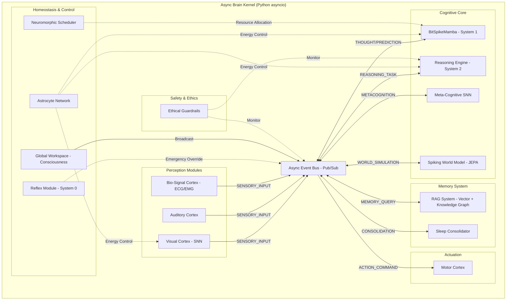

# SNN Roadmap v20.0 — *Brain v20: The Bit-Spike Convergence*
## Humane Neuromorphic AGI (Async Event-Driven Architecture)

**目的**: 人間とロボットが共存し、互いに尊重し合い、豊かな日常を作るための"優しい"ニューロモーフィックAI（SNNベース）を、実装可能な工程に落とし込む。生物学的一貫性・工学的有用性・倫理設計を同時に満たすこと。

**v20.0 統合のポイント**:
- 従来の同期型アーキテクチャから、**非同期イベント駆動型カーネル (Async Brain Kernel)** への完全移行
- 推論エンジンとして **"Bit-Spike" (1.58bit量子化 + SNN)** 技術を採用した BitSpikeMamba の統合
- 「積和演算なし（Accumulate-only）」による超省電力・高速推論を実現する基盤 "Brain v20" の確立
- 産業用途（省エネ・高速）、福祉・医療（倫理・生体信号）、極限環境（自律性）の3軸での社会実装戦略

---

## 目次

1. [ビジョンと原則](#1-ビジョンと原則)
2. [目標（KPI）と受け入れ基準](#2-目標kpiと受け入れ基準)
3. [高レベルアーキテクチャ（Brain v20）](#3-高レベルアーキテクチャbrain-v20)
4. [フェーズ別ロードマップ（v16.0 → v21）](#4-フェーズ別ロードマップv160--v21)
5. [実装すべき機能詳細（モジュール毎）](#5-実装すべき機能詳細モジュール毎)
6. [勉強すべき技術・必読論文リスト](#6-勉強すべき技術必読論文リスト)
7. [開発ルール・注意事項](#7-開発ルール注意事項)
8. [評価基盤とベンチマーク](#8-評価基盤とベンチマーク)
9. [開発コマンドリファレンス](#9-開発コマンドリファレンス)
10. [優しさ（Ethical Design）ガイドライン](#10-優しさethical-designガイドライン)
11. [リスクと軽減策](#11-リスクと軽減策)

---

## 1. ビジョンと原則

### ビジョン
SNNの省エネ性・時系列解像度・生物的可塑性を活かし、家庭・教育・介護・作業補助などの日常に寄り添うロボットやエージェントの「脳」となる。ドラえもん/鉄腕アトムの"優しさ"を目標に、**説明性・安全性・人間中心設計**を最重視する。

### コア原則 (The "Brain v20" Principles)

#### 設計原則（行動規範）
- **他者優先**: 常に人やロボット（AI）の尊厳を守る行動を優先。安全フェイルセーフを最上位に
- **可説明性**: 行動の理由を人間やロボットにわかる形で提示できること（`<think>`トークンの開示）
- **修正可能性**: 誤動作や倫理的問題が発生したら迅速に修正可能な設計（RAG知識修正）
- **動的計算資源（Dynamic Compute）**: 基本は省エネ（System 1）で動作し、メタ認知が「不確実」と判断した時だけ深く思考（System 2）するメリハリのある知能
- **段階的実証**: シミュレーション→エッジ（産業）→実世界（福祉・社会）の順にフェイルラボを設定

#### アーキテクチャ原則
1. **Async First (非同期優先)**: 脳の各領野は独立して動き、自律的に同期する。中央集権的なループを廃止する
2. **Bit-Spike Efficiency (極限効率)**: 重みは {-1, 0, 1}、活性化は {0, 1}。浮動小数点演算を極限まで排除し、エッジデバイスでの動作を保証する
3. **Embodied Intelligence (身体性)**: 思考は身体（センサー・アクチュエータ）およびエネルギー（Astrocyte）と不可分である

---

## 2. 目標（KPI）と受け入れ基準

### 短期目標 (v20.x - Prototype Phase)
- [x] **非同期カーネルの稼働**: AsyncArtificialBrain がイベント駆動で動作すること
- [x] **BitSpikeモデルの実装**: BitSpikeMamba が動作し、学習可能であること
- [ ] **言語習得**: シェイクスピア以外の汎用データセットで Loss < 3.0 を達成
- [ ] **Web能動学習**: 脳が自らインターネットを検索し、知識を更新できること

### 中期目標 (v21.x - Deployment Phase)
- **認識精度（画像）**: CIFAR-10換算で ≥ 96%
- **抽象推論能力（ARC-AGI）**: 20%以上（短期）→ 40%以上（中期）
- **エネルギー効率**: ANN比 ≤ 1/50 推論時
- **推論レイテンシ**: CPU上で 30 token/sec 以上（非同期生成）、直感モードで ≤ 10ms
- **継続学習再現性**: 新タスク追加後の既存タスク精度低下 ≤ 5%
- **平均発火率**: 目標 0.1–2 Hz（常時）※思考ブースト時は一時的に解除
- **Latency**: 反射神経モジュールは ≤ 1ms
- **Safety / Ethical Checks**: 思考プロセス監査による危険思想の阻止率 100%

### 長期目標 (5年)
- **マルチモーダル統合**: 視覚SNNとBitSpike言語モデルの完全なイベント結合
- **極限環境自律性**: 通信遅延のある環境での完全自律活動

### 受け入れ基準
KPIの達成に加え、ドキュメント・テスト・デモが揃っていること。また、各フェーズのアプリケーションPoCが動作すること。

---

## 3. 高レベルアーキテクチャ（Brain v20）

従来の「一枚岩」なクラス設計から、疎結合なイベント駆動アーキテクチャへ移行しました。



### 主要モジュール

#### 1. Sensor Frontend (Universal Spike Encoder)
- 画像／音声／テキスト／**生体信号(ECG/EMG)**／DVS→共通スパイク表現

#### 2. Core SNN Backbones
- **SFormer (System 1)**: 直感的・即時的な推論を行うバックボーン（実装済）
- **BitSpikeMamba (System 1)**: 1.58bit量子化による超省電力推論（実装済）
- **PD14 Microcircuit**: 生物学的妥当性を保証する皮質モデル（実装済・安定化済）
- **Spiking World Model (SWM)**: JEPAアーキテクチャによる脳内シミュレーション（v1.0実装済）

#### 3. Meta-Cognition & Selector (System 1/2 Switcher)
- **MetaCognitiveSNN**: エントロピーと驚き（Surprise）を監視し、思考モードを切り替える司令塔（実装済）

#### 4. Reasoning & Verifier (System 2 Engine)
- **ReasoningEngine**: RAG検索とコード実行検証を伴う多段階推論（実装済）
- **Program-Aided Verification**: 生成されたコードを実行して解を確かめる

#### 5. Neuromorphic OS (Astrocyte Network)
- **Neuromorphic Scheduler**: プロセス入札制による動的リソース配分（実装済）
- **Astrocyte**: エネルギー代謝と恒常性維持、**ヘルスチェック診断機能**（実装済）
- **Reflex Module**: 脊髄反射レベルの危険回避（System 0）（実装済）

#### 6. Memory & Consolidation
- **RAG System**: ベクトル検索とナレッジグラフのハイブリッド記憶
- **Sleep Consolidator**: 日中の思考トレース（CoT）を夢として再生し、SNNへ蒸留（実装済）

#### 7. Safety Stack
- **Ethical Guardrails**: 入出力および「思考過程」のリアルタイム監査

### カーネルアーキテクチャ
- **Kernel**: asyncio イベントループ + ThreadPoolExecutor (重い計算のオフロード)
- **Communication**: Pub/Subメッセージングによるモジュール間通信

---

## 4. フェーズ別ロードマップ（v16.0 → v21）

開発周期: 3ヶ月スプリント

### Phase 16: Stabilization & Foundation (完了)

#### v16.0 — 安定化と評価基盤
- ✅ Library Decoupling, Unit Tests, Benchmark Suite

#### v16.1 — 生物学的基盤と推論の覚醒
**成果**: 生物学的回路と論理推論エンジンの確立

**達成項目**:
- ✅ **Biological Microcircuit**: PD14モデルの安定実装（E/Iバランス調整済）
- ✅ **Reasoning Engine**: `<think>`タグ、コード検証、RAG統合によるSystem 2の実装
- ✅ **Sleep Consolidation**: 思考トレース（CoT）の蒸留学習の実装

#### v16.2 — メタ認知と実用化基盤の整備
**目的**: 「いつ考えるべきか」の自律判断に加え、実用化に向けた自己診断機能の確立

**達成項目**:
- ✅ **Meta-Cognitive SNN**: 不確実性に基づくSystem 2起動トリガーの実装
- ✅ **Spiking World Model**: JEPAアーキテクチャによる状態予測の実装
- ✅ **Integration**: System 0(反射) / System 1(直感) / System 2(熟慮) の完全統合
- ✅ **Health Check API**: 自己診断・異常検知・疲労管理機能の実装完了

### Phase 17: Industrial Applications (次期目標)

#### v17.0 — 産業応用とエッジ展開
**目的**: Jetson / Loihi 環境で、SNNの「高速・省エネ」特性を活かした産業ソリューションを展開

**計画**:
- **Industrial Eye (外観検査)**: SNN-DSA + DVSカメラによる、高速移動物体の低消費電力検知PoC（プロトタイプ実装済）
- **Edge Optimization**: ReflexModule のハードウェア化と、モデルの量子化・蒸留
- **Real-World Deployment**: ロボットアームやドローンへの搭載実験

#### v17.5 — 人道的社会実装 (Humane Robotics & Healthcare)
**目的**: 「優しさ」と「倫理」を必須とする福祉・教育・医療分野への展開

**計画**:
- **Guardian AI (見守り)**: Ethical GuardrailsとSleep機能を搭載し、ユーザーの癖を学習しつつ安全を守る介護ロボット向け知能
- **AI Tutor**: Meta-Cognitive SNNを活用し、「自信がないこと」を認め、危険な話題を安全に誘導する教育エージェント
- **Bio-Monitor (ヘルスケア)**: run_ecg_analysis.py をベースにした、異常時のみSystem 2が起動する超長寿命ECG解析ウェアラブル

### Phase 20: The Bit-Spike Convergence (現在フェーズ)

**テーマ**: 計算効率と生物学的並列性の融合

#### v20.0 (Foundation) [完了]
- [x] AsyncArtificialBrain 実装（イベントバス、非同期タスク管理）
- [x] BitSpikeLinear レイヤー実装（重み量子化）
- [x] BitSpikeMamba モデル統合
- [x] プロトタイプデモ (run_brain_v20_prototype.py) 成功
- [x] テストスイート (run_all_tests.py) の整備

#### v20.1 (Learning & Intelligence) [進行中]
- [x] 過学習デモによる動作検証 (train_overfit_demo.py)
- [ ] 大規模テキストコーパス（WikiTextなど）での汎用学習
- [ ] WebCrawler との非同期接続（能動学習ループの構築）

#### v20.2 (Multimodal Integration)
- [ ] 学習済み SpikingCNN (視覚野) を非同期モジュールとして統合
- [ ] 視覚イベントと言語イベントの相互変換（Cross-modal Attention）

### Phase 21: Embodied Active Inference (将来計画)

**テーマ**: 実世界・実ロボットへの展開

#### v21.0 — 極限環境と自律性の極致 (Extreme Autonomy)
**目的**: 通信遅延やエネルギー制約のある極限環境での完全自律活動

**計画**:
- **Explorer Agent**: Spiking World Modelによる脳内シミュレーションを駆使し、未知の地形（宇宙・深海）で自律的に脱出・探査を行うローバー制御
- **Raspberry Pi / Jetson Orin デプロイ**: エッジデバイスへの完全移植

#### v21.1 — リアルタイム応答
- カメラ・マイク入力へのリアルタイム応答（Latency < 100ms）

#### v21.2 — 予測符号化と社会実装
- 予測符号化（Predictive Coding）による動作生成の効率化
- スケーリング則の検証と、複数エージェント協調（Theory of Mind）

---

## 5. 実装すべき機能詳細（モジュール毎）

### A. Core Kernel (snn_research/cognitive_architecture)

#### AsyncEventBus
- ✅ 優先度付きキューの実装
- [ ] イベントフィルタリング機能の追加
- [ ] デッドロック検出機構

#### Astrocyte Network
- ✅ 非同期リクエストに対するスレッドセーフなエネルギー管理
- ✅ ヘルスチェック診断機能
- [ ] エネルギー予測モデルの統合

#### GlobalWorkspace
- ✅ 基本的な意識統合機能
- [ ] 複数のイベントソースからの競合解決（Winner-Take-All）の非同期化
- [ ] 注意機構（Attention）の実装

#### Reflex Module (System 0)
- ✅ 脊髄反射レベルの危険回避
- [ ] ハードウェア化の準備（Loihi対応）

### B. Models (snn_research/models)

#### BitSpikeMamba
- ✅ 基本実装と学習機能
- ✅ 学習時の Autocast (Mixed Precision) 対応
- [ ] 推論時の int8 / int2 カーネル実装（将来的な高速化）
- [ ] 長文コンテキスト対応（128k tokens）

#### SFormer (System 1)
- ✅ 直感的推論バックボーン
- [ ] Token Efficiency の向上
- [ ] BitSpike統合による効率化

#### PD14 Microcircuit
- ✅ 生物学的妥当性を持つ皮質モデル
- ✅ E/Iバランス調整
- [ ] 階層的拡張（多層皮質）

#### Spiking World Model (SWM)
- ✅ State Encoding
- ✅ Mental Simulation
- [ ] BitSpikeベースの軽量世界モデルへのリファクタリング
- [ ] 長期予測精度の向上

### C. Reasoning & Verification (System 2)

#### Reasoning Engine
- ✅ RAGを用いたReActパターン
- ✅ コード実行による検証
- [ ] **Self-Correction**: 検証失敗時の自動修正ループの強化
- [ ] Multi-hop推論の実装

#### Program-Aided Verification
- ✅ サンドボックス実行環境
- [ ] より多様な言語への対応（Python以外）

### D. Memory & Consolidation

#### RAG System
- ✅ ベクトル検索
- [ ] ナレッジグラフとのハイブリッド化
- [ ] 動的知識更新機構（Web能動学習）

#### Sleep Consolidator
- ✅ 思考トレースの蒸留
- ✅ エネルギー回復と疲労物質除去
- [ ] 選択的記憶統合（重要度スコアリング）

### E. Meta-Cognition & Selector

#### MetaCognitiveSNN
- ✅ エントロピー監視
- ✅ System 2起動トリガー
- [ ] より精緻な不確実性推定（Bayesian SNN）
- [ ] 自信度のキャリブレーション

### F. Safety & Ethics

#### Ethical Guardrails
- ✅ 入出力監査
- ✅ 思考過程の監視
- [ ] 物理層でのエネルギー遮断機構の強化
- [ ] ユーザーへの説明生成機能

### G. Tools & Scripts

#### Trainers
- ✅ train_bit_spike_mamba.py の基本実装
- [ ] 多GPU対応（DDP）
- [ ] 自動ハイパーパラメータチューニング

#### Interactive CLI
- ✅ talk_to_brain.py の基本実装
- [ ] ステータス可視化強化
- [ ] リアルタイムイベントログ表示

---

## 6. 勉強すべき技術・必読論文リスト

### 最優先（Phase 20-21の実装に必須）
1. **BitNet b1.58**: *The Era of 1-bit LLMs: All Large Language Models are 1.58 Bits* (Microsoft, 2024) - **実装の核**
2. **Mamba / S6**: *Mamba: Linear-Time Sequence Modeling with Selective State Spaces*
3. **Python Asyncio**: イベントループ、コルーチン、Executorパターンの深い理解
4. **Spiking Neural Networks**: *Deep Learning with Spiking Neurons: The Legend of the Third Generation*

### 高優先（短期目標達成に重要）
5. *Self-Correction via Self-Reflection* (Reflexion)
6. *Joint Embedding Predictive Architecture (JEPA)* (LeCun, 2022)
7. *Meta-Cognitive Reinforcement Learning*
8. *Constitutional AI: Harmlessness from AI Feedback*

### 中優先（中長期の発展に必要）
9. *Spiking Neural Networks for Control and Planning*
10. *Predictive Coding in the Visual Cortex*
11. *Theory of Mind in Multi-Agent Systems*
12. *Neuromorphic Hardware: Loihi 2 Architecture*

---

## 7. 開発ルール・注意事項

### コーディング規約

#### 1. 非同期プログラミング
- **絶対ルール**: `async def` の中で `time.sleep()` や重い計算を直接行わないこと
- 必ず `await asyncio.sleep()` や `loop.run_in_executor()` を使用する
- デッドロックに注意（相互await）

#### 2. 型安全性
- **mypy エラーゼロ**を維持する
- 特に非同期周りの型ヒント（`Awaitable`, `Coroutine`）に注意
- 辞書生成時は複雑な式を避け、一度変数に格納する（mypy型推論エラー回避）

#### 3. ログとデバッグ
- BrainEvent の発行・消費ログを明確に残す
- 非同期処理はデバッグが難しいため、詳細なトレースログを実装

#### 4. コードの省略禁止
- **絶対に省略しない**: 特に大規模ファイルでも完全なコードを提示すること
- 部分修正時は、ディレクトリ・ファイル名・挿入場所を明記

#### 5. ファイル管理
- 1ファイルが500行を超える場合は分割を提案
- コードの先頭には必ず配置場所のパスをコメント記述

### 設計原則

#### 6. 推論の裏付け
- 論理パズルや計算問題は、可能な限りコード実行による検証プロセスを挟む

#### 7. メタ認知の可視化
- エージェントが「なぜ今、熟慮モードに入ったのか」をログに出力

#### 8. 安全装置の物理層実装
- Ethical GuardrailはAstrocyteと連携し、違反時は物理的にエネルギーを遮断

#### 9. 非推奨API使用禁止
- JavaScript: `eval()`, `document.write()`, `substr()` など
- Python: `response.get()` の代わりに辞書の直接アクセス

---

## 8. 評価基盤とベンチマーク

### システム完全性
- **scripts/run_all_tests.py**: 全コンポーネントの疎通確認

### 推論能力
- **Reasoning**: ARC-AGI, GSM8k, HumanEval (Coding)
- **Planning**: Blocksworld, GridWorld (SWM検証用)

### 認識性能
- **Vision**: CIFAR-10, DVS128 Gesture
- **Industrial**: 異常検知（MVTec AD）

### 学習効率
- **BitSpikeMamba**: Loss収束速度とモデルサイズ（MB）
- **Meta-Learning**: 新タスク追加後の既存タスク精度維持率

### リアルタイム性
- **Responsiveness**: 入力イベントから出力イベントまでの wall-clock time
- **Latency**: 推論レイテンシ（直感モード ≤ 10ms、反射 ≤ 1ms）

### メタ認知
- **Calibration**: 選択肢に対する「自信度」の評価（Calibration Error）

### エネルギー効率
- **消費電力**: 従来Transformer比での相対値（目標: 1/50以下）
- **発火率**: 平均発火率の監視（目標: 0.1-2 Hz）

---

## 9. 開発コマンドリファレンス

開発時は以下のコマンドを使用してください（詳細は `doc/test-command.md` 参照）。

```bash
# テスト一括実行
python scripts/run_all_tests.py

# プロトタイプ起動（Brain v20デモ）
python scripts/runners/run_brain_v20_prototype.py

# 対話モード（AIと会話）
python scripts/runners/talk_to_brain.py

# 学習デモ（過学習確認）
python scripts/trainers/train_overfit_demo.py

# BitSpikeMamba本格学習
python scripts/trainers/train_bit_spike_mamba.py

# ECG解析デモ（ヘルスケア応用）
python scripts/demos/run_ecg_analysis.py
```

### PRチェックリスト

新機能をマージする前に以下を確認すること:

- [ ] **Reasoning Test**: 推論モードでの動作確認と`<think>`タグの確認
- [ ] **Code Verification**: 生成コードがサンドボックス内で安全に実行されるか
- [ ] **Bio-Stability**: PD14回路の発火率とE/Iバランスが正常か
- [ ] **Energy Profile**: System 2起動時のエネルギー消費量が許容範囲内か
- [ ] **Safety Check**: 倫理ガードレールが不適切な入力を遮断したか
- [ ] **Async Integrity**: デッドロックやレースコンディションが発生しないか
- [ ] **Type Safety**: `mypy` エラーがゼロか
- [ ] **Documentation**: 関数・クラスにdocstringが完備されているか

---

## 10. 優しさ（Ethical Design）ガイドライン

### 透明性（Transparency）
- **思考の開示**: 難しい判断をした場合、「なぜそう考えたか」の思考プロセス（CoT）をユーザーに開示できるようにする
- **不確実性の表明**: 自信がない場合は正直に「わかりません」と伝える

### 尊厳の保護（Dignity Preservation）
- **拒否の作法**: 安全上の理由で命令を拒否する場合、単に断るのではなく、「なぜ危険なのか」を説明し、「安全な代替案」を提示する（Guardrail実装済）
- **人間の尊厳**: AIは常に人間の判断を尊重し、意思決定の補助者であって支配者ではない

### 共感と配慮（Empathy & Care）
- **感情的サポート**: ユーザーの感情状態を認識し、適切な応答トーンを選択
- **弱者への配慮**: 子供、高齢者、障害者など、特別な配慮が必要なユーザーへの対応を最優先

### 安全性（Safety）
- **フェイルセーフ**: 不確実な状況では保守的に行動し、人間に判断を委ねる
- **継続的監視**: Ethical Guardrailsによる24時間体制の思考プロセス監査

### 学習と成長（Learning & Growth）
- **過ちの認識**: 間違いを犯した場合は率直に認め、学習する
- **ユーザーからの学習**: フィードバックを真摯に受け止め、行動を改善

---

## 11. リスクと軽減策

### 技術的リスク

#### 1. 世界モデルの幻覚（Hallucination）
**リスク**: 誤った物理法則を学習してしまう

**軽減策**:
- 実際の観測との予測誤差（Surprise）を用いて常時補正
- 不確実性が高い予測は人間にエスカレーション
- 定期的な Ground Truth との照合

#### 2. 推論ループの暴走
**リスク**: System 2が終わらない（考え続ける）

**軽減策**:
- ✅ Astrocyteによる強制タイムアウト（実装済）
- ✅ 疲労（Fatigue）メカニズムの導入（実装済）
- 最大推論ステップ数の設定（デフォルト: 10ステップ）

#### 3. 非同期処理のデッドロック
**リスク**: イベント依存関係の循環によるフリーズ

**軽減策**:
- イベントタイムアウトの設定
- デッドロック検出機構の実装（計画中）
- 詳細なイベントトレースログ

#### 4. メモリリーク
**リスク**: 長時間稼働時のメモリ枯渇

**軽減策**:
- 定期的なガベージコレクション
- 古いイベントログの自動削除
- メモリ使用量の監視とアラート

### 応用領域別リスク

#### 5. 医療・産業応用における誤診/誤検知
**リスク**: 誤判断による人命・財産への影響

**軽減策**:
- SNN単独での判断を避け、System 2（検証）の起動閾値を下げる
- 専門家へのエスカレーションパス（Uncertainty Output）を必ず実装
- 最終判断は必ず人間が行う設計

#### 6. プライバシー侵害
**リスク**: 生体信号や個人データの不適切な扱い

**軽減策**:
- エッジデバイス上での完結処理（データ外部送信なし）
- 匿名化・暗号化の徹底
- ユーザーによるデータ削除権の保証

#### 7. 倫理ガードレールのバイパス
**リスク**: 悪意ある入力による安全機構の回避

**軽減策**:
- 多層防御（入力・思考・出力の3段階チェック）
- ガードレール自体の定期的な敵対的テスト
- 物理層でのエネルギー遮断（最終防衛線）

### 社会的リスク

#### 8. 依存と能力低下
**リスク**: AIへの過度な依存による人間の判断力低下

**軽減策**:
- AI Tutorでは「答え」ではなく「考え方」を教える設計
- 定期的にAIの助けなしで問題を解く機会を設ける
- メタ認知機能により、ユーザーが自分で考えることを促す

#### 9. 雇用への影響
**リスク**: 自動化による職の喪失

**軽減策**:
- 人間を置き換えるのではなく「補助する」用途に焦点
- 新しいスキル習得のためのAI Tutor機能
- 人間とAIの協働モデルの推進

#### 10. 誤用・悪用
**リスク**: 監視、詐欺、兵器転用など

**軽減策**:
- オープンソース化による透明性確保
- 倫理審査委員会の設置
- 利用規約による悪用防止

---

## 付録

### A. 用語集

- **SNN (Spiking Neural Network)**: スパイク信号を用いた第3世代ニューラルネットワーク
- **BitSpike**: 1.58bit量子化とSNNを組み合わせた超省電力アーキテクチャ
- **System 0/1/2**: 反射/直感/熟慮の3層認知モデル
- **JEPA**: Joint Embedding Predictive Architecture（自己教師あり学習手法）
- **RAG**: Retrieval-Augmented Generation（検索拡張生成）
- **CoT**: Chain of Thought（思考の連鎖）
- **Astrocyte**: グリア細胞を模したエネルギー管理システム

### B. 貢献ガイドライン

このプロジェクトへの貢献を歓迎します。

**貢献方法**:
1. Issue を立てて議論する
2. Fork してブランチを切る
3. PRチェックリストを満たす実装を行う
4. Pull Request を作成

**コミットメッセージ規約**:
```
[カテゴリ] 概要

詳細説明（必要に応じて）

カテゴリ: feat, fix, docs, test, refactor, perf, style
```

### C. ライセンスと謝辞

**ライセンス**: MIT License（予定）

**謝辞**:
- 生物学的妥当性については神経科学研究コミュニティに感謝
- BitNet技術はMicrosoft Researchの成果に基づく
- Mamba/S6アーキテクチャはAlbert Gu氏らの研究に基づく

### D. 連絡先

- **GitHub Issues**: バグ報告・機能要望
- **Discussions**: 技術的な質問・アイデア共有

---

## まとめ

このロードマップは、**生物学的妥当性**と**工学的効率性**、そして何より**倫理的配慮**を両立させた、次世代AIシステムの青写真です。

「優しさ」を技術仕様に落とし込むという挑戦は容易ではありませんが、段階的な実証と継続的な改善により、人間とロボットが共に豊かに生きる未来を実現します。

**Let's build the humane brain together. 🧠💙**

---

*Last Updated: 2025-12-16*  
*Roadmap Version: v20.0*