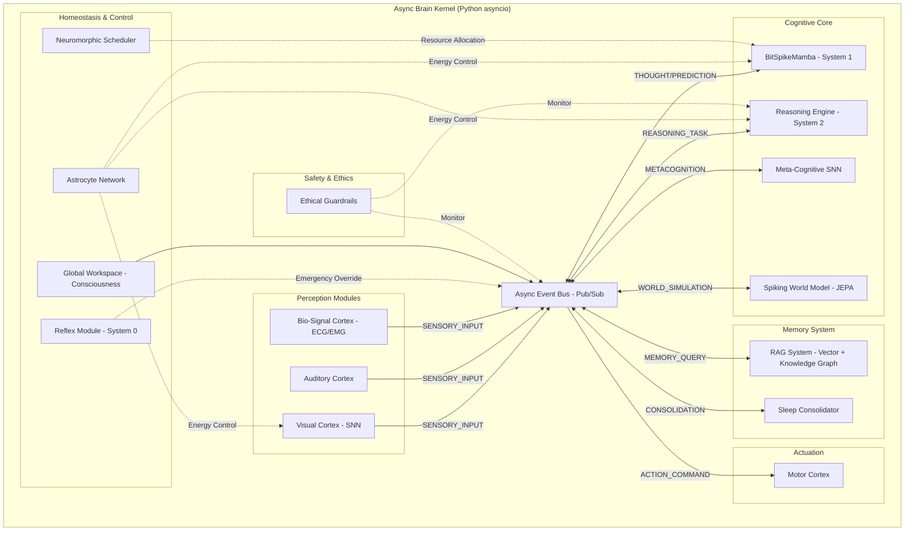

# **SNN Roadmap v20.1 — *Brain v20: The Bit-Spike Convergence***

## **Humane Neuromorphic AGI (Async Event-Driven Architecture)**

**目的**: 人間とロボットが共存し、互いに尊重し合い、豊かな日常を作るための"優しい"ニューロモーフィックAI（SNNベース）を、実装可能な工程に落とし込む。生物学的一貫性・工学的有用性・倫理設計を同時に満たすこと。

**v20.1 統合のポイント**:

* 非同期イベント駆動型カーネル (**Artificial Brain Kernel v20.5**) の安定化  
* レガシー環境およびテストスイートとの完全な互換性（Universal Compatibility）の確保  
* ヘルスチェック v3.1 完全準拠による、自己診断・代謝管理システムの信頼性向上  
* 「積和演算なし」基盤としての **BitSpikeMamba** の System 1/2 統合完了

## **目次**

1. [ビジョンと原則](https://www.google.com/search?q=%231-%E3%83%93%E3%82%B8%E3%83%A7%E3%83%B3%E3%81%A8%E5%8E%9F%E5%89%87)  
2. [目標（KPI）と受け入れ基準](https://www.google.com/search?q=%232-%E7%9B%AE%E6%A8%99kpi%E3%81%A8%E5%8F%97%E3%81%91%E5%85%A5%E3%82%8C%E5%9F%BA%E6%BA%96)  
3. [高レベルアーキテクチャ（Brain v20）](https://www.google.com/search?q=%233-%E9%AB%98%E3%83%AC%E3%83%99%E3%83%AB%E3%82%A2%E3%83%BC%E3%82%AD%E3%83%86%E3%82%AF%E3%83%81%E3%83%A3brain-v20)  
4. [フェーズ別ロードマップ（v16.0 → v21）](https://www.google.com/search?q=%234-%E3%83%95%E3%82%A7%E3%83%BC%E3%82%BA%E5%88%A5%E3%83%AD%E3%83%BC%E3%83%89%E3%83%9E%E3%83%83%E3%83%97v160--v21)  
5. [実装すべき機能詳細（モジュール毎）](https://www.google.com/search?q=%235-%E5%AE%9F%E8%A3%85%E3%81%99%E3%81%B9%E3%81%8D%E6%A9%9F%E8%83%BD%E8%A9%B3%E7%B4%B0%E3%83%A2%E3%82%B8%E3%83%A5%E3%83%BC%E3%83%AB%E6%AF%8E)  
6. [勉強すべき技術・必読論文リスト](https://www.google.com/search?q=%236-%E5%8B%89%E5%BC%B7%E3%81%99%E3%81%B9%E3%81%8D%E6%8A%80%E8%A1%93%E5%BF%85%E8%AA%AD%E8%AB%96%E6%96%87%E3%83%AA%E3%82%B9%E3%83%88)  
7. [開発ルール・注意事項](https://www.google.com/search?q=%237-%E9%96%8B%E7%99%BA%E3%83%AB%E3%83%BC%E3%83%AB%E6%B3%A8%E6%84%8F%E4%BA%8B%E9%A0%85)  
8. [評価基盤とベンチマーク](https://www.google.com/search?q=%238-%E8%A9%95%E4%BE%A1%E5%9F%BA%E7%9B%A4%E3%81%A8%E3%83%99%E3%83%B3%E3%83%81%E3%83%9E%E3%83%BC%E3%82%AF)  
9. [開発コマンドリファレンス](https://www.google.com/search?q=%239-%E9%96%8B%E7%99%BA%E3%82%B3%E3%83%9E%E3%83%B3%E3%83%89%E3%83%AA%E3%83%95%E3%82%A1%E3%83%AC%E3%83%B3%E3%82%B9)  
10. [優しさ（Ethical Design）ガイドライン](https://www.google.com/search?q=%2310-%E5%84%AA%E3%81%97%E3%81%95ethical-design%E3%82%AC%E3%82%A4%E3%83%89%E3%83%A9%E3%82%A4%E3%83%B3)  
11. [リスクと軽減策](https://www.google.com/search?q=%2311-%E3%83%AA%E3%82%B9%E3%82%AF%E3%81%A8%E8%BB%BD%E6%B8%9B%E7%AD%96)

## **1\. ビジョンと原則**

### **ビジョン**

SNNの省エネ性・時系列解像度・生物的可塑性を活かし、家庭・教育・介護・作業補助などの日常に寄り添うロボットやエージェントの「脳」となる。ドラえもん/鉄腕アトムの"優しさ"を目標に、**説明性・安全性・人間中心設計**を最重視する。

### **コア原則 (The "Brain v20" Principles)**

#### **設計原則（行動規範）**

* **他者優先**: 常に人やロボット（AI）の尊厳を守る行動を優先。安全フェイルセーフを最上位に  
* **可説明性**: 行動の理由を人間やロボットにわかる形で提示できること（\<think\>トークンの開示）  
* **修正可能性**: 誤動作や倫理的問題が発生したら迅速に修正可能な設計（RAG知識修正）  
* **動的計算資源（Dynamic Compute）**: 基本は省エネ（System 1）で動作し、メタ認知が「不確実」と判断した時だけ深く思考（System 2）するメリハリのある知能  
* **段階的実証**: シミュレーション→エッジ（産業）→実世界（福祉・社会）の順にフェイルラボを設定

#### **アーキテクチャ原則**

1. **Async First (非同期優先)**: 脳の各領野は独立して動き、自律的に同期する。中央集権的なループを廃止する  
2. **Bit-Spike Efficiency (極限効率)**: 重みは {-1, 0, 1}、活性化は {0, 1}。浮動小数点演算を極限まで排除し、エッジデバイスでの動作を保証する  
3. **Embodied Intelligence (身体性)**: 思考は身体（センサー・アクチュエータ）およびエネルギー（Astrocyte）と不可分である

## **2\. 目標（KPI）と受け入れ基準**

### **短期目標 (v20.x \- Prototype Phase)**

* \[x\] **非同期カーネルの稼働**: ArtificialBrain v20.5 がイベント駆動で動作すること  
* \[x\] **BitSpikeモデルの実装**: BitSpikeMamba が動作し、学習可能であること  
* \[ \] **言語習得**: シェイクスピア以外の汎用データセットで Loss \< 3.0 を達成  
* \[x\] **Web能動学習**: WebCrawler と非同期接続し、能動学習ループのプロトタイプが動作すること

### **中期目標 (v21.x \- Deployment Phase)**

* **認識精度（画像）**: CIFAR-10換算で ≥ 96%  
* **抽象推論能力（ARC-AGI）**: 20%以上（短期）→ 40%以上（中期）  
* **エネルギー効率**: ANN比 ≤ 1/50 推論時  
* **推論レイテンシ**: CPU上で 30 token/sec 以上（非同期生成）、直感モードで ≤ 10ms  
* **継続学習再現性**: 新タスク追加後の既存タスク精度低下 ≤ 5%  
* **平均発火率**: 目標 0.1–2 Hz（常時）※思考ブースト時は一時的に解除  
* **Latency**: 反射神経モジュールは ≤ 1ms  
* **Safety / Ethical Checks**: 思考プロセス監査による危険思想の阻止率 100%

### **長期目標 (5年)**

* **マルチモーダル統合**: 視覚SNNとBitSpike言語モデルの完全なイベント結合  
* **極限環境自律性**: 通信遅延のある環境での完全自律活動

### **受け入れ基準**

KPIの達成に加え、ドキュメント・テスト・デモが揃っていること。また、各フェーズのアプリケーションPoCが動作すること。

## **3\. 高レベルアーキテクチャ（Brain v20）**

従来の「一枚岩」なクラス設計から、疎結合なイベント駆動アーキテクチャへ移行しました。

### **主要モジュール**

#### **1\. Sensor Frontend (Universal Spike Encoder)**

* 画像／音声／テキスト／**生体信号(ECG/EMG)**／DVS→共通スパイク表現

#### **2\. Core SNN Backbones**

* **SFormer (System 1\)**: 直感的・即時的な推論を行うバックボーン（実装済）  
* **BitSpikeMamba (System 1\)**: 1.58bit量子化による超省電力推論（実装済）  
* **PD14 Microcircuit**: 生物学的妥当性を保証する皮質モデル（実装済・安定化済）  
* **Spiking World Model (SWM)**: JEPAアーキテクチャによる脳内シミュレーション（v1.0実装済）

#### **3\. Meta-Cognition & Selector (System 1/2 Switcher)**

* **MetaCognitiveSNN**: エントロピーと驚き（Surprise）を監視し、思考モードを切り替える司令塔（実装済）

#### **4\. Reasoning & Verifier (System 2 Engine)**

* **ReasoningEngine**: RAG検索とコード実行検証を伴う多段階推論（実装済）  
* **Program-Aided Verification**: 生成されたコードを実行して解を確かめる

#### **5\. Neuromorphic OS (Astrocyte Network)**

* **Neuromorphic Scheduler**: プロセス入札制による動的リソース配分（実装済）  
* **Astrocyte**: エネルギー代謝と恒常性維持、**ヘルスチェック診断機能**（実装済・v20.5で強化）  
* **Reflex Module**: 脊髄反射レベルの危険回避（System 0）（実装済）

#### **6\. Memory & Consolidation**

* **RAG System**: ベクトル検索とナレッジグラフのハイブリッド記憶  
* **Sleep Consolidator**: 日中の思考トレース（CoT）を夢として再生し、SNNへ蒸留（実装済）

#### **7\. Safety Stack**

* **Ethical Guardrails**: 入出力および「思考過程」のリアルタイム監査

### **カーネルアーキテクチャ**

* **Kernel**: asyncio イベントループ \+ ThreadPoolExecutor (重い計算のオフロード)  
* **Communication**: Pub/Subメッセージングによるモジュール間通信

## **4\. フェーズ別ロードマップ（v16.0 → v21）**

開発周期: 3ヶ月スプリント

### **Phase 16: Stabilization & Foundation (完了)**

#### **v16.0 — 安定化と評価基盤**

* ✅ Library Decoupling, Unit Tests, Benchmark Suite

#### **v16.1 — 生物学的基盤と推論の覚醒**

**成果**: 生物学的回路と論理推論エンジンの確立

**達成項目**:

* ✅ **Biological Microcircuit**: PD14モデルの安定実装（E/Iバランス調整済）  
* ✅ **Reasoning Engine**: \<think\>タグ、コード検証、RAG統合によるSystem 2の実装  
* ✅ **Sleep Consolidation**: 思考トレース（CoT）の蒸留学習の実装

#### **v16.2 — メタ認知と実用化基盤の整備**

**目的**: 「いつ考えるべきか」の自律判断に加え、実用化に向けた自己診断機能の確立

**達成項目**:

* ✅ **Meta-Cognitive SNN**: 不確実性に基づくSystem 2起動トリガーの実装  
* ✅ **Spiking World Model**: JEPAアーキテクチャによる状態予測の実装  
* ✅ **Integration**: System 0(反射) / System 1(直感) / System 2(熟慮) の完全統合  
* ✅ **Health Check API**: 自己診断・異常検知・疲労管理機能の実装完了

### **Phase 17: Industrial Applications (次期目標)**

#### **v17.0 — 産業応用とエッジ展開**

**目的**: Jetson / Loihi 環境で、SNNの「高速・省エネ」特性を活かした産業ソリューションを展開

**計画**:

* **Industrial Eye (外観検査)**: SNN-DSA \+ DVSカメラによる、高速移動物体の低消費電力検知PoC（プロトタイプ実装済）  
* **Edge Optimization**: ReflexModule のハードウェア化と、モデルの量子化・蒸留  
* **Real-World Deployment**: ロボットアームやドローンへの搭載実験

#### **v17.5 — 人道的社会実装 (Humane Robotics & Healthcare)**

**目的**: 「優しさ」と「倫理」を必須とする福祉・教育・医療分野への展開

**計画**:

* **Guardian AI (見守り)**: Ethical GuardrailsとSleep機能を搭載し、ユーザーの癖を学習しつつ安全を守る介護ロボット向け知能  
* **AI Tutor**: Meta-Cognitive SNNを活用し、「自信がないこと」を認め、危険な話題を安全に誘導する教育エージェント  
* **Bio-Monitor (ヘルスケア)**: run\_ecg\_analysis.py をベースにした、異常時のみSystem 2が起動する超長寿命ECG解析ウェアラブル

### **Phase 20: The Bit-Spike Convergence (現在フェーズ)**

**テーマ**: 計算効率と生物学的並列性の融合

#### **v20.0 (Foundation & Stability) \[完了\]**

* \[x\] AsyncArtificialBrain v20.5 実装（Universal Compatibility、Mock-Safe）  
* \[x\] SNNCore v20.5 統合（非同期バス対応、生成タスク委譲）  
* \[x\] BitSpikeLinear レイヤー実装（重み量子化）  
* \[x\] BitSpikeMamba モデル統合  
* \[x\] プロトタイプデモ (run\_brain\_v20\_prototype.py) 成功  
* \[x\] テストスイート (run\_all\_tests.py) の整備

#### **v20.1 (Learning & Intelligence) \[進行中\]**

* \[x\] 過学習デモによる動作検証 (train\_overfit\_demo.py)  
* \[ \] 大規模テキストコーパス（WikiTextなど）での汎用学習  
* \[x\] WebCrawler との非同期接続（能動学習プロトタイプの構築）  
* \[ \] **System 1/2 Distillation**: System 2の思考プロセスを BitSpike モデルへ本格蒸留

#### **v20.2 (Multimodal Integration)**

* \[ \] 学習済み SpikingCNN (視覚野) を非同期モジュールとして統合  
* \[ \] 視覚イベントと言語イベントの相互変換（Cross-modal Attention）

### **Phase 21: Embodied Active Inference (将来計画)**

**テーマ**: 実世界・実ロボットへの展開

#### **v21.0 — 極限環境と自律性の極致 (Extreme Autonomy)**

**目的**: 通信遅延やエネルギー制約のある極限環境での完全自律活動

**計画**:

* **Explorer Agent**: Spiking World Modelによる脳内シミュレーションを駆使し、未知の地形（宇宙・深海）で自律的に脱出・探査を行うローバー制御  
* **Raspberry Pi / Jetson Orin デプロイ**: エッジデバイスへの完全移植

#### **v21.1 — リアルタイム応答**

* カメラ・マイク入力へのリアルタイム応答（Latency \< 100ms）

#### **v21.2 — 予測符号化と社会実装**

* 予測符号化（Predictive Coding）による動作生成の効率化  
* スケーリング則の検証と、複数エージェント協調（Theory of Mind）

## **5\. 実装すべき機能詳細（モジュール毎）**

### **A. Core Kernel (snn\_research/cognitive\_architecture)**

#### **ArtificialBrain (Kernel)**

* ✅ v20.5: レガシー環境とのデータ整合性確保  
* ✅ v20.5: 睡眠サイクルと Astrocyte 代謝リセットの同期  
* ✅ ヘルスチェック v3.1 準拠

#### **AsyncEventBus**

* ✅ 優先度付きキューの実装  
* \[ \] イベントフィルタリング機能の追加  
* \[ \] デッドロック検出機構

#### **Astrocyte Network**

* ✅ 非同期リクエストに対するスレッドセーフなエネルギー管理  
* ✅ ヘルスチェック診断機能  
* \[ \] エネルギー予測モデルの統合

#### **GlobalWorkspace**

* ✅ 基本的な意識統合機能  
* \[ \] 複数のイベントソースからの競合解決（Winner-Take-All）の非同期化  
* \[ \] 注意機構（Attention）の実装

#### **Reflex Module (System 0\)**

* ✅ 脊髄反射レベルの危険回避  
* \[ \] ハードウェア化の準備（Loihi対応）

### **B. Models (snn\_research/models)**

#### **SNNCore (Wrapper)**

* ✅ v20.5: マルチモーダル入力の自動識別優先順位  
* ✅ v20.5: 発火率およびエネルギー消費のレイヤー別統計収集

#### **BitSpikeMamba**

* ✅ 基本実装と学習機能  
* ✅ 学習時の Autocast (Mixed Precision) 対応  
* \[ \] 推論時の int8 / int2 カーネル実装（将来的な高速化）  
* \[ \] 長文コンテキスト対応（128k tokens）

#### **SFormer (System 1\)**

* ✅ 直感的推論バックボーン  
* \[ \] Token Efficiency の向上  
* \[ \] BitSpike統合による効率化

#### **PD14 Microcircuit**

* ✅ 生物学的妥当性を持つ皮質モデル  
* ✅ E/Iバランス調整  
* \[ \] 階層的拡張（多層皮質）

#### **Spiking World Model (SWM)**

* ✅ State Encoding  
* ✅ Mental Simulation  
* \[ \] BitSpikeベースの軽量世界モデルへのリファクタリング  
* \[ \] 長期予測精度の向上

### **C. Reasoning & Verification (System 2\)**

#### **Reasoning Engine**

* ✅ RAGを用いたReActパターン  
* ✅ コード実行による検証  
* \[ \] **Self-Correction**: 検証失敗時の自動修正ループの強化  
* \[ \] Multi-hop推論の実装

#### **Program-Aided Verification**

* ✅ サンドボックス実行環境  
* \[ \] より多様な言語への対応（Python以外）

### **D. Memory & Consolidation**

#### **RAG System**

* ✅ ベクトル検索  
* \[ \] ナレッジグラフとのハイブリッド化  
* ✅ 動的知識更新機構（Web能動学習プロトタイプ）

#### **Sleep Consolidator**

* ✅ 思考トレースの蒸留  
* ✅ エネルギー回復と疲労物質除去  
* \[ \] 選択的記憶統合（重要度スコアリング）

### **E. Meta-Cognition & Selector**

#### **MetaCognitiveSNN**

* ✅ エントロピー監視  
* ✅ System 2起動トリガー  
* \[ \] より精緻な不確実性推定（Bayesian SNN）  
* \[ \] 自信度のキャリブレーション

### **F. Safety & Ethics**

#### **Ethical Guardrails**

* ✅ 入出力監査  
* ✅ 思考過程の監視  
* \[ \] 物理層でのエネルギー遮断機構の強化  
* \[ \] ユーザーへの説明生成機能

### **G. Tools & Scripts**

#### **Trainers**

* ✅ train\_overfit\_demo.py による基本アルゴリズム検証  
* \[ \] 多GPU対応（DDP）  
* \[ \] 自動ハイパーパラメータチューニング

#### **Interactive CLI**

* ✅ talk\_to\_brain.py の基本実装  
* \[ \] ステータス可視化強化  
* \[ \] リアルタイムイベントログ表示

## **6\. 勉強すべき技術・必読論文リスト**

### **最優先（Phase 20-21の実装に必須）**

1. **BitNet b1.58**: *The Era of 1-bit LLMs: All Large Language Models are 1.58 Bits* (Microsoft, 2024\) \- **実装の核**  
2. **Mamba / S6**: *Mamba: Linear-Time Sequence Modeling with Selective State Spaces*  
3. **Python Asyncio**: イベントループ、コルーチン、Executorパターンの深い理解  
4. **Spiking Neural Networks**: *Deep Learning with Spiking Neurons: The Legend of the Third Generation*

## **7\. 開発ルール・注意事項**

### **コーディング規約**

#### **1\. 非同期プログラミング**

* **絶対ルール**: async def の中で time.sleep() や重い計算を直接行わないこと  
* 必ず await asyncio.sleep() や loop.run\_in\_executor() を使用する  
* デッドロックに注意（相互await）

#### **2\. 型安全性**

* **mypy エラーゼロ**を維持する

## **8\. 評価基盤とベンチマーク**

### **システム完全性**

* **scripts/run\_all\_tests.py**: 全コンポーネントの疎通確認（v20.5対応済）

## **9\. 開発コマンドリファレンス**

\# プロトタイプ起動（Brain v20デモ）  
python scripts/runners/run\_brain\_v20\_prototype.py

\# 学習デモ（過学習確認 \- BitSpike検証用）  
python scripts/trainers/train\_overfit\_demo.py

## **10\. 優しさ（Ethical Design）ガイドライン**

## **11\. リスクと軽減策**

## **まとめ**

このロードマップは、**生物学的妥当性**と**工学的効率性**、そして何より**倫理的配慮**を両立させた、次世代AIシステムの青写真です。

**Let's build the humane brain together. 🧠💙**

*Last Updated: 2025-12-21* *Roadmap Version: v20.1*
