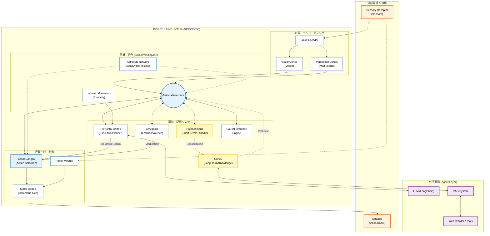

# **SNN Project: 次世代ニューロモルフィックAIアーキテクチャ**

## **1. プロジェクト概要**

本プロジェクトは、人間の脳の構造と機能を模倣した **Spiking Neural Network (SNN)** を基盤とし、従来のDeep Learning (ANN) の効率性と生物学的学習則（STDP等）の適応性を融合させた、次世代の汎用人工知能 (AGI) アーキテクチャを開発しています。

現在の到達点である **Brain v2.0** では、TransformerやState Space Models (Mamba)、BitNetといった最新のアーキテクチャをSNNとして再構築し、高度な認知アーキテクチャ（海馬、大脳基底核、扁桃体など）と統合することで、低消費電力でありながら、推論、記憶、自己適応能力を持つシステムの実現を目指しています。

## **2. 最新状況 (Brain v2.0 & Beyond)**

プロジェクトは現在、**Phase 4: Brain v2.0 Integration & Scaling** の段階にあります。

### **主要な到達点**

* **Brain v2.0 Core:** 認知機能の中核となる統合アーキテクチャの実装完了。Global Workspace Theoryに基づくモジュール間連携を実現。
* **Advanced Hybrid Models:**
  * **Spiking Mamba:** 状態空間モデル (SSM) をSNNに適用し、長期間の時系列依存関係を効率的に処理。
  * **Spiking Transformer / S-Former:** アテンション機構のスパイクベース実装。
  * **BitNet (Bit Spike):** 重みの1bit量子化による超軽量・高速推論モデル。
* **Neuromorphic OS:** ハードウェアリソースを抽象化し、複数のSNNプロセス（思考、知覚、記憶整理など）を協調させるOS層のプロトタイプ。
* **LLM Integration:** LangChainアダプターを通じた、外部大規模言語モデル (LLM) と内部SNNの双方向連携。
* **Cognitive Distillation:** LLMの高度な知識を、軽量なSNNモデルへ蒸留 (Distillation) するパイプラインの確立。

## **3. システムアーキテクチャ**

システムは、生物学的妥当性と工学的実用性のバランスを考慮した階層型アーキテクチャを採用しています。

### **システム相関図 (System Interaction Diagram)**

Brain v2.0における各モジュールの相互作用、データフロー、および外部システムとの連携を以下の図に示します。



### **3.1 認知アーキテクチャ (Cognitive Architecture)**

`snn_research/cognitive_architecture/` に実装されている、脳の各部位を模したモジュール群です。

| コンポーネント | 役割 | 実装の特徴 |
|:---|:---|:---|
| **Global Workspace (GWT)** | 意識的な情報処理の場 | 各モジュールからの入力を競合・統合し、全体へブロードキャストする。 |
| **Prefrontal Cortex (PFC)** | 司令塔・ワーキングメモリ | 目標設定、計画立案、トップダウンの注意制御を行う。 |
| **Hippocampus** | 長期記憶・エピソード記憶 | 経験の短期保存と、睡眠フェーズにおける長期記憶への固定化 (Consolidation)。 |
| **Basal Ganglia** | 行動選択・強化学習 | 報酬に基づく行動の選択 (Action Selection) とドーパミン変調。 |
| **Amygdala** | 感情・情動 | 入力刺激に対する感情価 (Valence) の評価と、緊急時の優先制御。 |
| **Thalamus** | 感覚情報のゲートウェイ | 感覚入力の中継と、注意によるフィルタリング。 |
| **Cortex** | 知覚・運動処理 | 視覚 (Visual)、聴覚、体性感覚などの分散処理。 |

### **3.2 コアテクノロジー (Core Research)**

`snn_research/core/` および `snn_research/models/` に実装されています。

* **Adaptive Neurons:** LIF (Leaky Integrate-and-Fire) をベースに、適応的な閾値調整や恒常性維持 (Homeostasis) を組み込んだニューロンモデル。
* **Learning Rules:**
  * **STDP (Spike-Timing-Dependent Plasticity):** スパイクタイミングに基づく局所的な学習。
  * **R-STDP (Reward-modulated STDP):** 報酬信号による変調を加えた強化学習則。
  * **BPTT (Backpropagation Through Time):** サロゲート勾配を用いた時間方向の誤差逆伝播。
  * **Predictive Coding:** 予測誤差を最小化するように結合を更新する推論学習。
* **Sleep Mode:** 外部入力を遮断し、蓄積された記憶をリプレイしてネットワークを最適化・構造化する機能。

### **3.3 アプリケーション層**

`app/` ディレクトリには、SNNコアを利用するためのインターフェースが含まれています。

* **Unified Perception Demo:** 視覚、言語などを統合したデモ。
* **LangChain Adapter:** SNNをLangChainのChainやAgentとして利用するためのアダプター。
* **Dashboard:** 脳活動（発火パターン、膜電位、各部位の活性度）をリアルタイムで可視化するWeb UI。

## **4. ディレクトリ構造**

現在のプロジェクト構造の概要です。

```
SNN/
├── app/                        # Webアプリケーション・インターフェース
│   ├── adapters/               # LangChain連携用アダプター
│   ├── services/               # チャット、画像認識などのサービス
│   └── ...
├── benchmarks/                 # ベンチマークテスト
├── configs/                    # 実験・モデル設定ファイル
│   ├── experiments/            # 実験ごとの設定
│   └── models/                 # モデル定義
├── deployment/                 # デプロイメント用マニフェスト
├── doc/                        # プロジェクトドキュメント
├── experiments/                # 実験実行用スクリプト
├── results/                    # 実験結果ログとレポート
├── scripts/                    # 実行・ユーティリティスクリプト
│   ├── experiments/            # 実験・デモ実行用スクリプト (brain, applications, systems等)
│   ├── training/               # 学習ループの実装
│   ├── visualization/          # 可視化ツール
│   ├── optimization/           # HPOなど最適化
│   ├── demos/                  # 各種デモ
│   └── ...
├── snn_research/               # SNN研究開発コアライブラリ
│   ├── adaptive/               # 自己適応・自己修復メカニズム
│   ├── agent/                  # エージェント実装
│   ├── cognitive_architecture/ # 脳部位モジュール
│   ├── core/                   # SNN基本クラス
│   ├── distillation/           # 知識蒸留・圧縮パイプライン
│   ├── hardware/               # ハードウェアシミュレータ
│   ├── hybrid/                 # ANN-SNNハイブリッド
│   ├── io/                     # スパイクエンコーディング
│   ├── learning_rules/         # 学習則
│   ├── models/                 # アーキテクチャ別モデル実装
│   ├── optimization/           # 進化計算・構造探索
│   └── visualization/          # 脳活動可視化ツール
├── tests/                      # ユニットテスト・統合テスト
└── workspace/                  # 生成物・ログ・結果の出力先
    ├── runs/                   # TensorBoardログなど
    ├── results/                # 実験結果レポート・図
    ├── logs/                   # アプリケーションログ
    └── checkpoints/            # 学習済みモデルチェックポイント
```

## **5. 主要な実行スクリプト (Quick Start)**

`scripts/` ディレクトリには、様々な実験やデモを実行するためのスクリプトが用意されています。

### **Brain v2.0 の実行**

最新の統合脳モデルを実行します。

```bash
python scripts/experiments/brain/run_brain_v20_prototype.py
# または視覚機能付き
python scripts/experiments/brain/run_brain_v20_vision.py
```

### **特定機能のデモ**

* **マルチモーダル統合:**
  ```bash
  python scripts/demos/run_multimodal_demo.py
  ```

* **睡眠学習と記憶の定着:**
  ```bash
  python scripts/demos/run_sleep_learning_demo.py
  ```

* **ニューロシンボリック推論:**
  ```bash
  python scripts/demos/run_neuro_symbolic_demo.py
  ```

* **エージェント行動 (Active Inference):**
  ```bash
  python scripts/demos/run_active_inference_demo.py
  ```

### **CLIツールによる操作**

`snn-cli.py` を使用して、設定生成や学習を一元管理できます。

```bash
# Brain v2.0用の設定ファイルを生成
python snn-cli.py generate-config --type brain_v20 --output my_brain_config.yaml

# 設定ファイルに基づいてトレーニングを実行
python snn-cli.py train --config my_brain_config.yaml
```

## **6. セットアップ**

### **必要要件**

* Python 3.8 以上
* CUDA Toolkit 11.x/12.x (GPUアクセラレーション利用時)
* PyTorch (CUDA対応版推奨)

### **インストール手順**

1. **リポジトリのクローン:**
   ```bash
   git clone <repository_url>
   cd SNN
   ```

2. **依存ライブラリのインストール:**
   ```bash
   pip install -r requirements.txt
   ```
   
   *Google Colab環境の場合は `sh setup_colab.sh` を実行してください。*

3. **環境変数の設定 (Optional):**
   APIキーやログレベルなどを `.env` ファイルまたは環境変数で設定します。

## **7. 今後のロードマップ**

* **Short-term:**
  * Brain v2.0の安定性向上と、より複雑なタスクへの適用。
  * SNN-LLM間の知識転移（蒸留）プロセスの自動化。
* **Mid-term:**
  * 専用ハードウェア (FPGA/ASIC) 向けコンパイラの完成と実機デプロイ。
  * 大規模分散環境でのマルチエージェントシミュレーション。
* **Long-term:**
  * 意識の創発メカニズムの解明と実装 (Emergent Consciousness)。
  * 省電力かつ自律的なAGIシステムの実現。
